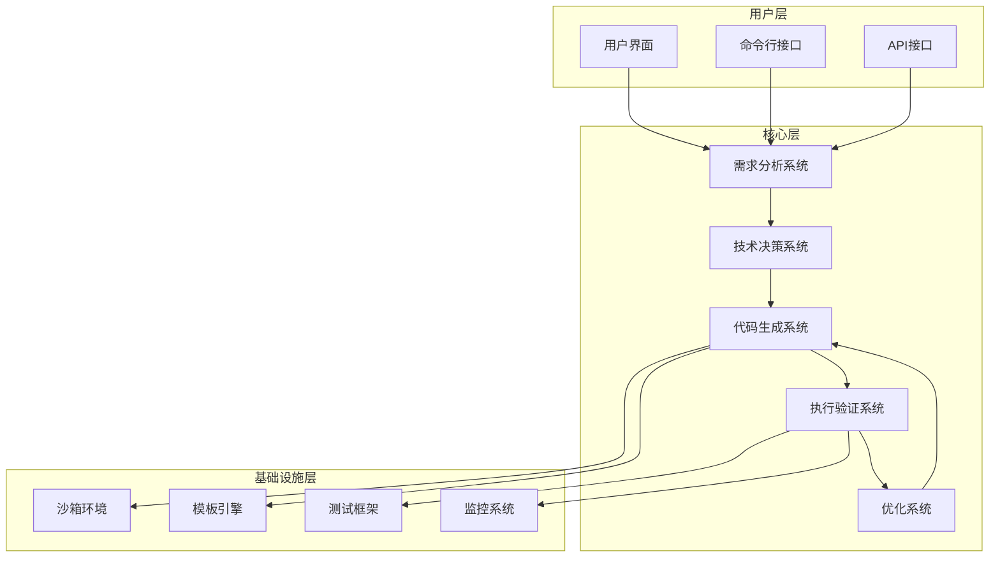
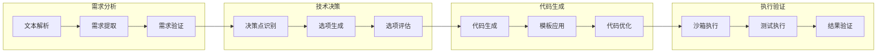
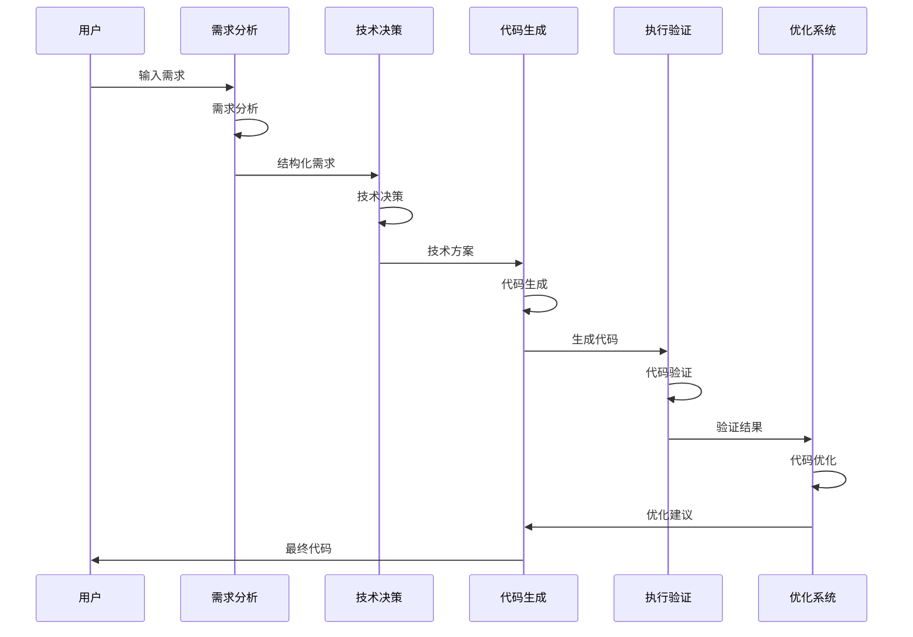
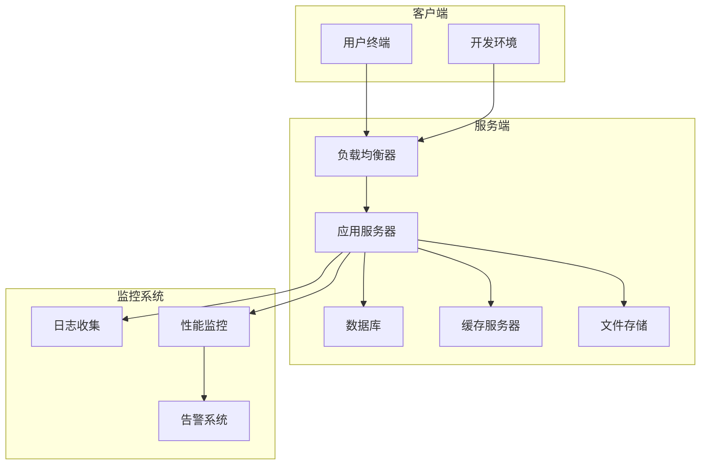

# 系统架构图

本文档通过多个维度的架构图，详细描述了系统的整体架构。

## 整体架构图

## 模块关系图

## 数据流图

## 部署架构图

## 组件说明

### 1. 用户层
- **用户界面**：Web界面，提供可视化操作
- **命令行接口**：CLI工具，支持脚本化操作
- **API接口**：RESTful API，支持第三方集成

### 2. 核心层
- **需求分析系统**：解析和结构化用户需求
- **技术决策系统**：选择合适的技术方案
- **代码生成系统**：生成高质量代码
- **执行验证系统**：验证代码正确性
- **优化系统**：持续改进代码质量

### 3. 基础设施层
- **沙箱环境**：安全的代码执行环境
- **模板引擎**：代码生成模板系统
- **测试框架**：自动化测试系统
- **监控系统**：系统监控和告警

## 部署要求

### 1. 硬件要求
- CPU: 8核心以上
- 内存: 16GB以上
- 存储: 100GB以上
- 网络: 千兆网络

### 2. 软件要求
- 操作系统: Linux/Unix
- Python: 3.8+
- 数据库: PostgreSQL 12+
- 缓存: Redis 6+

### 3. 网络要求
- 内网带宽: 1Gbps以上
- 外网带宽: 100Mbps以上
- 防火墙: 支持端口控制

## 扩展性设计

### 1. 水平扩展
- 支持多节点部署
- 负载均衡
- 数据分片

### 2. 垂直扩展
- 支持资源升级
- 性能优化
- 功能扩展

### 3. 功能扩展
- 插件系统
- 自定义模板
- 自定义验证规则

## 相关文档

- [核心模块设计](./core-modules.md)
- [安全架构](./security-architecture.md)
- [性能架构](./performance-architecture.md) 