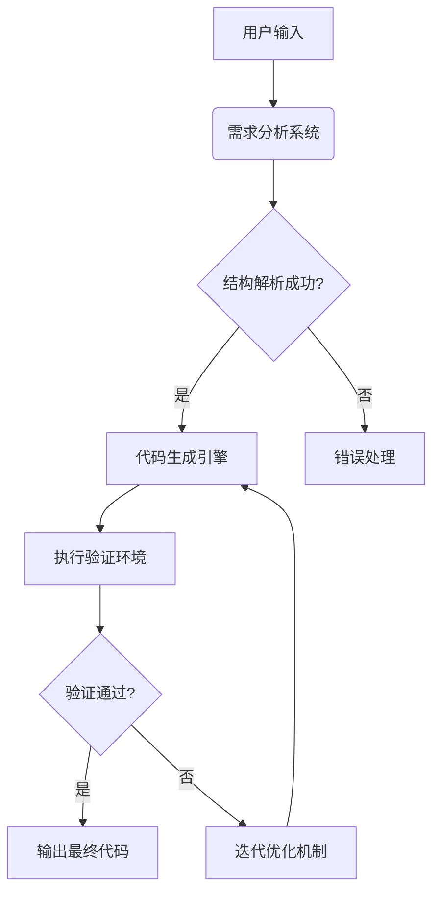

# 核心模块设计

本文档详细描述了全自动Python后端编程系统的核心模块设计和技术架构。

## 模块交互流程

## 系统架构

系统采用模块化设计，各组件之间通过标准化接口通信，实现高内聚低耦合的架构特点。

### 核心组件

| 模块 | 主要职责 | 输入 | 输出 |
|------|----------|------|------|
| 需求分析系统 | 将自然语言需求转换为结构化规范 | 文本描述 | 任务规范JSON |
| 代码生成引擎 | 基于规范生成符合要求的代码 | 任务规范 | Python代码 |
| 执行验证环境 | 安全测试代码并验证其正确性 | Python代码 | 验证报告 |
| 迭代优化机制 | 基于反馈改进生成的代码 | 代码+报告 | 优化后代码 |

## 技术选型

| 模块 | 技术方案 | 关键依赖 |
|------|----------|----------|
| 需求分析 | NLP模型+DSL解析 | SpaCy, Lark |
| 代码生成 | 模板引擎+大模型 | Jinja2, OpenAI API |
| 执行验证 | 沙箱环境+测试生成 | RestrictedPython, Hypothesis |
| 优化迭代 | 遗传算法+版本控制 | DEAP, GitPython |

## 数据流

1. **用户输入** → 文本字符串
2. **需求分析** → 结构化任务描述(JSON)
3. **代码生成** → Python源代码
4. **执行验证** → 测试结果和性能指标
5. **迭代优化** → 改进后的Python代码

## 扩展点

系统设计中预留了多个扩展点，允许未来集成额外功能：

1. **需求分析插件系统**：支持领域特定的需求解析器
2. **代码生成模板库**：可扩展的代码模板集合
3. **测试策略注册机制**：自定义测试用例生成策略
4. **优化器插件**：可插拔式代码优化器

## 安全考量

- 所有生成的代码在执行前进行静态分析和安全检查
- 执行环境采用沙箱隔离，限制资源访问
- 敏感操作（文件系统、网络）需要显式权限
- 输入验证防止注入攻击

## 性能优化

- 缓存常用代码模板和生成结果
- 并行执行验证测试
- 增量式代码优化而非完全重生成
- 分布式计算支持（用于大型代码生成任务） 