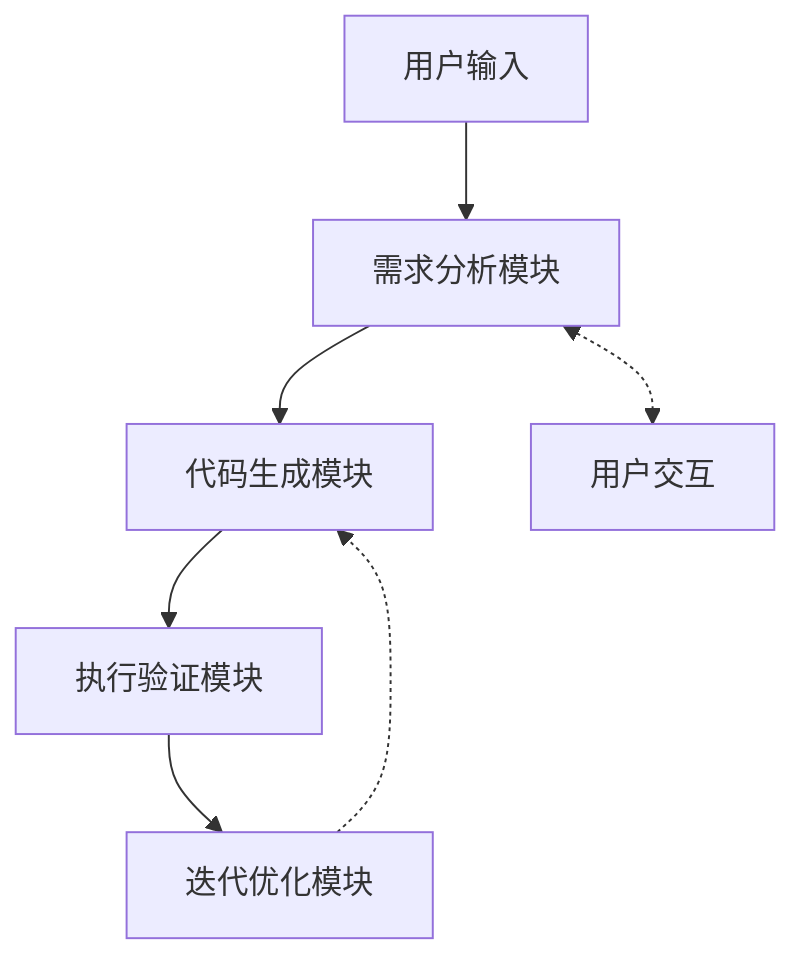

# 需求分析模块集成指南

## 文档信息

| 属性 | 值 |
|------|------|
| 文档状态 | 初稿 |
| 版本号 | v0.1.0 |
| 撰写日期 | 2023-03-25 |
| 所属模块 | 需求分析系统 |

## 1. 概述

本文档提供关于如何将需求分析模块集成到全自动编程系统中的详细指南。需求分析模块作为系统的入口组件，负责将自然语言需求转换为结构化任务描述，需要与其他模块（尤其是代码生成模块）紧密协作。本指南面向系统集成工程师和模块开发人员，提供端到端集成的完整流程和最佳实践。

## 2. 系统架构

### 2.1 模块间关系



### 2.2 集成点

需求分析模块与其他模块的主要集成点如下：

| 接口方向 | 集成模块 | 主要功能 | 数据流 |
|---------|----------|----------|--------|
| 输出 | 代码生成模块 | 提供结构化需求规范 | 需求分析模块 → 代码生成模块 |
| 输入 | 用户交互模块 | 接收澄清问题的回答 | 用户交互模块 → 需求分析模块 |
| 输入 | 迭代优化模块 | 接收基于执行结果的需求修正 | 迭代优化模块 → 需求分析模块 |

## 3. 接口规范

### 3.1 需求分析模块 → 代码生成模块

**接口类型**: REST API / 函数调用

**请求格式**:
```json
{
  "task_spec": {
    "task_type": "function",
    "inputs": [
      {
        "name": "data",
        "type": "List[Dict]",
        "description": "原始数据列表"
      }
    ],
    "outputs": {
      "type": "DataFrame",
      "description": "处理后的数据"
    },
    "constraints": [
      "使用pandas库",
      "处理过程不应修改原始数据"
    ]
  },
  "tech_decisions": [
    {
      "decision_point": "数据处理库",
      "selected_option": "pandas",
      "reasoning": "基于约束条件和性能要求选择pandas"
    }
  ],
  "metadata": {
    "confidence_score": 0.92,
    "analysis_timestamp": "2023-03-25T10:30:00Z"
  }
}
```

**响应格式**:
```json
{
  "status": "accepted",
  "task_id": "gen-123456",
  "estimated_completion_time": "2023-03-25T10:30:10Z"
}
```

### 3.2 用户交互模块 → 需求分析模块

**接口类型**: WebSocket / 回调函数

**请求格式**:
```json
{
  "session_id": "session-789012",
  "interaction_type": "clarification",
  "clarifications": {
    "question_id_1": "用户回答1",
    "question_id_2": "用户回答2"
  },
  "original_requirement": "创建一个处理CSV数据的API"
}
```

**响应格式**: 与3.1中的输出格式相同，或继续提问：
```json
{
  "session_id": "session-789012",
  "status": "needs_more_clarification",
  "questions": [
    {
      "id": "question_id_3",
      "question": "API需要支持哪些HTTP方法？",
      "options": ["GET", "POST", "PUT", "DELETE", "ALL"]
    }
  ]
}
```

## 4. 集成步骤

### 4.1 依赖安装

确保所有必要的依赖都已安装：

```bash
# 基础依赖
pip install nltk spacy pandas numpy

# 高级功能依赖
pip install scikit-learn tensorflow

# 开发与测试依赖
pip install pytest pytest-cov black
```

### 4.2 配置设置

1. 创建`config.json`文件，配置模块间的接口参数：

```json
{
  "requirement_analysis": {
    "api_endpoint": "http://localhost:8000/api/analyze",
    "max_response_time": 5000,
    "default_confidence_threshold": 0.75,
    "models_path": "./models/"
  },
  "code_generation": {
    "api_endpoint": "http://localhost:8001/api/generate",
    "result_callback": "http://localhost:8000/api/generation-result"
  },
  "user_interaction": {
    "websocket_endpoint": "ws://localhost:8002/ws/interaction"
  }
}
```

2. 环境变量配置：

```bash
# .env file
ANALYSIS_MODULE_PORT=8000
CODE_GEN_MODULE_PORT=8001
INTERACTION_MODULE_PORT=8002
LOG_LEVEL=INFO
MODEL_CACHE_SIZE=512
```

### 4.3 模块注册

在系统的主模块管理器中注册需求分析模块：

```python
# system_core.py
from requirement_analysis import RequirementAnalysisModule
from code_generation import CodeGenerationModule
from user_interaction import UserInteractionModule

class AutoProgrammingSystem:
    def __init__(self, config_path):
        self.config = self._load_config(config_path)
        
        # 初始化并注册模块
        self.modules = {}
        self.modules['requirement_analysis'] = RequirementAnalysisModule(
            self.config['requirement_analysis'])
        self.modules['code_generation'] = CodeGenerationModule(
            self.config['code_generation'])
        self.modules['user_interaction'] = UserInteractionModule(
            self.config['user_interaction'])
        
        # 设置模块间通信
        self._setup_module_communication()
    
    def _setup_module_communication(self):
        """设置模块间的通信机制"""
        # 需求分析模块生成规范后通知代码生成模块
        self.modules['requirement_analysis'].set_completion_callback(
            self.modules['code_generation'].process_requirement_spec)
        
        # 用户交互模块将澄清结果传递给需求分析模块
        self.modules['user_interaction'].set_clarification_callback(
            self.modules['requirement_analysis'].process_clarification)
```

### 4.4 API集成

如果使用REST API进行模块间通信，需要实现以下端点：

```python
# requirement_analysis_api.py
from fastapi import FastAPI, HTTPException
from pydantic import BaseModel

app = FastAPI()
analyzer = RequirementAnalysisEngine()

class RequirementRequest(BaseModel):
    text: str
    constraints: list = []
    session_id: str = None

class ClarificationRequest(BaseModel):
    session_id: str
    clarifications: dict
    original_requirement: str

@app.post("/api/analyze")
async def analyze_requirement(request: RequirementRequest):
    try:
        result = analyzer.analyze(
            request.text, 
            constraints=request.constraints,
            session_id=request.session_id
        )
        return result
    except Exception as e:
        raise HTTPException(status_code=500, detail=str(e))

@app.post("/api/clarify")
async def process_clarification(request: ClarificationRequest):
    try:
        result = analyzer.process_clarification(
            request.session_id,
            request.clarifications,
            request.original_requirement
        )
        return result
    except Exception as e:
        raise HTTPException(status_code=500, detail=str(e))
```

### 4.5 事件与消息机制

对于基于事件的集成，实现以下事件处理器：

```python
# event_handlers.py
class EventBus:
    def __init__(self):
        self.subscribers = {}
    
    def subscribe(self, event_type, callback):
        if event_type not in self.subscribers:
            self.subscribers[event_type] = []
        self.subscribers[event_type].append(callback)
    
    def publish(self, event_type, data):
        if event_type in self.subscribers:
            for callback in self.subscribers[event_type]:
                callback(data)

# 系统初始化时
event_bus = EventBus()

# 需求分析模块发布事件
event_bus.subscribe('requirement_analysis_completed', 
                  code_generation_module.handle_requirement_spec)

# 在需求分析完成时
def on_analysis_completed(requirement_spec):
    event_bus.publish('requirement_analysis_completed', requirement_spec)
```

## 5. 集成测试

### 5.1 端到端测试

创建端到端测试以验证集成的正确性：

```python
# integration_tests.py
def test_requirement_to_code_flow():
    """测试从需求分析到代码生成的完整流程"""
    # 初始化测试系统
    system = AutoProgrammingSystem('test_config.json')
    
    # 测试需求
    requirement = "创建一个函数，接收CSV文件路径，计算每列的平均值"
    
    # 处理需求
    result = system.process(requirement)
    
    # 验证结果
    assert result['status'] == 'success'
    assert 'code' in result
    
    # 验证代码功能
    assert 'def calculate_column_averages' in result['code']
    assert 'pandas' in result['code']
    assert 'return df.mean()' in result['code']
```

### 5.2 模拟与存根

为了隔离测试各模块，可以使用模拟对象：

```python
# mock_modules.py
class MockCodeGenerator:
    def __init__(self):
        self.received_specs = []
    
    def process_requirement_spec(self, spec):
        self.received_specs.append(spec)
        return {
            "status": "success",
            "code": f"def dummy_function():\n    # Generated from: {spec['task_type']}\n    pass"
        }

# 在测试中使用
def test_analysis_with_mock_generator():
    analyzer = RequirementAnalysisEngine()
    mock_generator = MockCodeGenerator()
    
    # 配置分析器使用模拟生成器
    analyzer.set_code_generator(mock_generator)
    
    # 分析需求
    analyzer.analyze("创建一个求和函数")
    
    # 验证模拟生成器收到了规范
    assert len(mock_generator.received_specs) == 1
    assert mock_generator.received_specs[0]['task_type'] == 'function'
```

## 6. 部署配置

### 6.1 Docker部署

使用Docker容器化部署各模块：

```dockerfile
# 需求分析模块的Dockerfile
FROM python:3.9-slim

WORKDIR /app

COPY requirements.txt .
RUN pip install --no-cache-dir -r requirements.txt

COPY . .

# 下载必要的模型和数据
RUN python -m spacy download en_core_web_sm
RUN python -m nltk.downloader punkt stopwords wordnet

EXPOSE 8000

CMD ["uvicorn", "requirement_analysis_api:app", "--host", "0.0.0.0", "--port", "8000"]
```

使用Docker Compose进行多模块部署：

```yaml
# docker-compose.yml
version: '3'

services:
  requirement-analysis:
    build: ./requirement_analysis
    ports:
      - "8000:8000"
    environment:
      - LOG_LEVEL=INFO
      - MODEL_CACHE_SIZE=512
    volumes:
      - ./models:/app/models

  code-generation:
    build: ./code_generation
    ports:
      - "8001:8001"
    depends_on:
      - requirement-analysis

  user-interaction:
    build: ./user_interaction
    ports:
      - "8002:8002"
    depends_on:
      - requirement-analysis
```

### 6.2 Kubernetes部署

对于大规模部署，提供Kubernetes配置：

```yaml
# requirement-analysis-deployment.yaml
apiVersion: apps/v1
kind: Deployment
metadata:
  name: requirement-analysis
spec:
  replicas: 3
  selector:
    matchLabels:
      app: requirement-analysis
  template:
    metadata:
      labels:
        app: requirement-analysis
    spec:
      containers:
      - name: requirement-analysis
        image: autoprogramming/requirement-analysis:latest
        ports:
        - containerPort: 8000
        env:
        - name: LOG_LEVEL
          value: "INFO"
        resources:
          requests:
            memory: "1Gi"
            cpu: "500m"
          limits:
            memory: "2Gi"
            cpu: "1"
        readinessProbe:
          httpGet:
            path: /health
            port: 8000
          initialDelaySeconds: 5
          periodSeconds: 10

---
apiVersion: v1
kind: Service
metadata:
  name: requirement-analysis-service
spec:
  selector:
    app: requirement-analysis
  ports:
  - port: 80
    targetPort: 8000
  type: ClusterIP
```

## 7. 监控与故障排除

### 7.1 健康检查端点

实现健康检查API以监控服务状态：

```python
@app.get("/health")
async def health_check():
    """服务健康检查接口"""
    # 检查核心组件
    components_status = {
        "preprocessor": check_preprocessor_health(),
        "semantic_analyzer": check_analyzer_health(),
        "dsl_converter": check_converter_health(),
        "database_connection": check_db_connection()
    }
    
    # 如果任何组件不健康，返回服务不可用
    if not all(components_status.values()):
        return JSONResponse(
            status_code=503,
            content={
                "status": "unhealthy",
                "components": components_status,
                "timestamp": datetime.now().isoformat()
            }
        )
    
    return {
        "status": "healthy",
        "components": components_status,
        "version": "1.0.0",
        "timestamp": datetime.now().isoformat()
    }
```

### 7.2 日志配置

使用结构化日志记录模块间交互：

```python
import logging
import json
from datetime import datetime

class StructuredLogger:
    def __init__(self, service_name):
        self.logger = logging.getLogger(service_name)
        self.service_name = service_name
    
    def _log(self, level, message, **kwargs):
        log_entry = {
            "timestamp": datetime.now().isoformat(),
            "service": self.service_name,
            "level": level,
            "message": message
        }
        log_entry.update(kwargs)
        self.logger.log(
            getattr(logging, level), 
            json.dumps(log_entry)
        )
    
    def info(self, message, **kwargs):
        self._log("INFO", message, **kwargs)
    
    def error(self, message, **kwargs):
        self._log("ERROR", message, **kwargs)
    
    def debug(self, message, **kwargs):
        self._log("DEBUG", message, **kwargs)

# 在模块通信时
logger = StructuredLogger("requirement_analysis")
logger.info(
    "发送需求规范到代码生成模块",
    spec_id=spec.id,
    task_type=spec.task_type,
    destination="code_generation"
)
```

### 7.3 故障排除指南

**常见问题与解决方案**：

1. **通信超时**
   - 现象：模块间请求超时
   - 解决方案：检查网络连接、增加超时设置、验证目标服务是否运行

2. **数据格式不匹配**
   - 现象：接收模块报告无效的数据格式
   - 解决方案：检查版本兼容性、验证JSON结构、更新接口文档

3. **资源不足**
   - 现象：服务崩溃或响应缓慢
   - 解决方案：增加资源限制、优化内存使用、添加缓存机制

4. **模型加载失败**
   - 现象：需求分析服务启动失败
   - 解决方案：验证模型文件路径、检查权限、确认模型版本兼容性

## 8. 安全考量

### 8.1 身份验证与授权

在模块间通信中实现安全机制：

```python
# 生成JWT令牌用于模块间认证
def generate_module_token(module_name, secret_key):
    payload = {
        "module": module_name,
        "exp": datetime.datetime.utcnow() + datetime.timedelta(hours=1)
    }
    return jwt.encode(payload, secret_key, algorithm="HS256")

# 在请求中使用令牌
def make_authenticated_request(url, data, module_name, secret_key):
    token = generate_module_token(module_name, secret_key)
    headers = {
        "Authorization": f"Bearer {token}",
        "Content-Type": "application/json"
    }
    response = requests.post(url, json=data, headers=headers)
    return response.json()
```

### 8.2 数据验证

确保输入输出数据的有效性：

```python
from pydantic import BaseModel, validator, Field

class TaskSpecification(BaseModel):
    task_type: str
    inputs: list
    outputs: dict = None
    constraints: list = []
    
    @validator('task_type')
    def valid_task_type(cls, v):
        allowed_types = ['function', 'api', 'class', 'script']
        if v not in allowed_types:
            raise ValueError(f'task_type must be one of {allowed_types}')
        return v
    
    @validator('inputs')
    def non_empty_inputs(cls, v):
        if not v:
            raise ValueError('inputs cannot be empty')
        return v
```

## 9. 版本兼容性

### 9.1 API版本控制

实现API版本控制以支持渐进式升级：

```python
# requirement_analysis_api.py
@app.post("/api/v1/analyze")
async def analyze_requirement_v1(request: RequirementRequestV1):
    # V1版本的处理逻辑
    pass

@app.post("/api/v2/analyze")
async def analyze_requirement_v2(request: RequirementRequestV2):
    # V2版本的处理逻辑，支持更多特性
    pass
```

### 9.2 兼容性矩阵

| 需求分析模块版本 | 代码生成模块最低版本 | 执行验证模块最低版本 | 兼容性说明 |
|-----------------|----------------------|----------------------|------------|
| v1.0.0 | v1.0.0 | v1.0.0 | 基础功能兼容 |
| v1.1.0 | v1.0.0 | v1.0.0 | 向后兼容，增强需求分析 |
| v2.0.0 | v1.5.0 | v1.2.0 | 需要更新的DSL规范格式 |

## 10. 常见集成场景示例

### 10.1 基础集成：分析需求并生成代码

```python
def process_requirement(requirement_text):
    # 1. 分析需求
    analyzer = RequirementAnalysisEngine()
    analysis_result = analyzer.analyze(requirement_text)
    
    # 2. 检查是否需要澄清
    if analysis_result['status'] == 'needs_clarification':
        # 处理澄清流程
        return handle_clarification(analysis_result)
    
    # 3. 生成代码
    code_generator = CodeGenerationEngine()
    generation_result = code_generator.generate(
        analysis_result['requirement_spec']
    )
    
    # 4. 返回结果
    return {
        "status": "success",
        "code": generation_result['code'],
        "analysis_summary": analysis_result['summary']
    }
```

### 10.2 高级集成：多轮澄清和迭代优化

```python
class ComplexIntegrationFlow:
    def __init__(self):
        self.analyzer = RequirementAnalysisEngine()
        self.code_generator = CodeGenerationEngine()
        self.validator = ExecutionValidator()
        self.optimizer = IterationOptimizer()
        self.sessions = {}
    
    def start_session(self, requirement_text, session_id=None):
        """启动新的处理会话"""
        if not session_id:
            session_id = f"session-{uuid.uuid4()}"
        
        # 初始分析
        analysis_result = self.analyzer.analyze(requirement_text)
        
        # 存储会话信息
        self.sessions[session_id] = {
            "original_requirement": requirement_text,
            "current_state": "initial_analysis",
            "analysis_result": analysis_result,
            "clarifications": {},
            "iterations": 0
        }
        
        # 检查是否需要澄清
        if analysis_result['status'] == 'needs_clarification':
            return {
                "session_id": session_id,
                "status": "needs_clarification",
                "questions": analysis_result['questions']
            }
        
        # 直接生成代码
        return self.generate_code(session_id)
    
    def provide_clarification(self, session_id, clarifications):
        """提供澄清信息"""
        if session_id not in self.sessions:
            raise ValueError(f"Unknown session: {session_id}")
        
        session = self.sessions[session_id]
        session['clarifications'].update(clarifications)
        
        # 使用原始需求和所有澄清重新分析
        updated_result = self.analyzer.analyze(
            session['original_requirement'],
            clarifications=session['clarifications']
        )
        
        session['analysis_result'] = updated_result
        session['current_state'] = "clarified_analysis"
        
        # 检查是否需要进一步澄清
        if updated_result['status'] == 'needs_clarification':
            return {
                "session_id": session_id,
                "status": "needs_clarification",
                "questions": updated_result['questions']
            }
        
        # 生成代码
        return self.generate_code(session_id)
    
    def generate_code(self, session_id):
        """基于分析结果生成代码"""
        session = self.sessions[session_id]
        spec = session['analysis_result']['requirement_spec']
        
        # 生成代码
        generation_result = self.code_generator.generate(spec)
        session['generation_result'] = generation_result
        session['current_state'] = "code_generated"
        
        # 验证代码
        validation_result = self.validator.validate(generation_result['code'])
        session['validation_result'] = validation_result
        
        if not validation_result['success']:
            # 优化代码
            session['current_state'] = "optimization"
            return self.optimize_code(session_id)
        
        return {
            "session_id": session_id,
            "status": "success",
            "code": generation_result['code'],
            "analysis_summary": session['analysis_result']['summary']
        }
    
    def optimize_code(self, session_id):
        """基于验证结果优化代码"""
        session = self.sessions[session_id]
        session['iterations'] += 1
        
        if session['iterations'] > MAX_ITERATIONS:
            return {
                "session_id": session_id,
                "status": "iteration_limit_reached",
                "code": session['generation_result']['code'],
                "validation_issues": session['validation_result']['issues']
            }
        
        # 进行优化
        optimization_result = self.optimizer.optimize(
            session['generation_result']['code'],
            session['validation_result'],
            session['analysis_result']['requirement_spec']
        )
        
        # 更新会话状态
        session['generation_result']['code'] = optimization_result['optimized_code']
        
        # 重新验证
        validation_result = self.validator.validate(optimization_result['optimized_code'])
        session['validation_result'] = validation_result
        
        if not validation_result['success']:
            # 继续优化
            return self.optimize_code(session_id)
        
        return {
            "session_id": session_id,
            "status": "success",
            "code": optimization_result['optimized_code'],
            "analysis_summary": session['analysis_result']['summary'],
            "iterations": session['iterations']
        }
```

## 11. 参考资源

- [系统架构文档](../architecture/core-modules.md)
- [需求分析模块API参考](../modules/requirement-analysis/api-design.md)
- [代码生成模块集成指南](../modules/code-generation/integration.md)
- [测试用例文档](../modules/requirement-analysis/test-cases.md) 