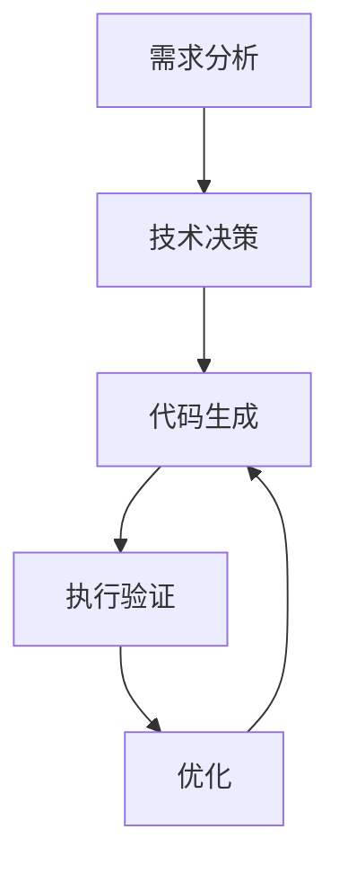

# 模块文档

本文档描述了全自动Python后端编程系统的各个核心模块。

## 模块结构

系统包含以下核心模块：

1. **[需求分析模块](./requirement_analysis/README.md)**
   - 基础功能：文本解析和需求提取
   - 高级功能：多层次需求挖掘和推理

2. **[技术决策模块](./technical_decision/README.md)**
   - 决策点识别
   - 选项生成
   - 选项评估
   - 决策记录

3. **[代码生成模块](./code_generation/README.md)**
   - 代码生成引擎
   - 模板系统
   - 代码优化

4. **[执行验证模块](./execution_validation/README.md)**
   - 安全沙箱环境
   - 测试用例生成
   - 结果验证

5. **[优化模块](./optimization/README.md)**
   - 性能优化
   - 代码重构
   - 迭代改进

## 模块交互

## 文档组织

每个模块的文档包含以下部分：

1. **概述**：模块的主要功能和目标
2. **架构**：模块的内部结构和组件
3. **接口**：模块的公共接口和API
4. **配置**：模块的配置选项
5. **使用示例**：常见使用场景和示例代码
6. **最佳实践**：使用建议和注意事项
7. **常见问题**：常见问题解答

## 快速开始

要开始使用系统，建议按以下顺序阅读文档：

1. 首先阅读[需求分析模块](./requirement_analysis/README.md)，了解如何描述需求
2. 然后查看[技术决策模块](./technical_decision/README.md)，了解系统如何选择技术方案
3. 接着阅读[代码生成模块](./code_generation/README.md)，了解代码生成过程
4. 最后查看[执行验证](./execution_validation/README.md)和[优化](./optimization/README.md)模块，了解如何确保代码质量

## 文档更新

本文档会随着系统开发持续更新。如果您发现任何问题或有改进建议，请提交 Issue 或 Pull Request。

## 相关文档

- [系统架构](../architecture/core-modules.md)
- [API参考](../api-reference.md)
- [开发指南](../development/README.md) 