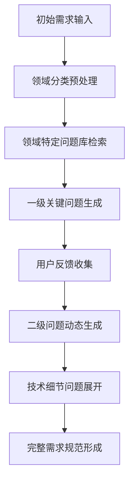
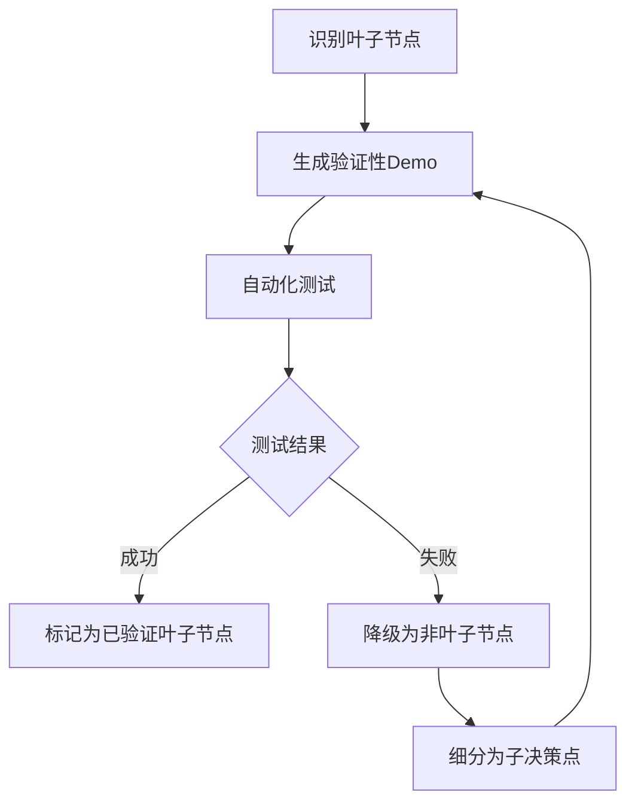
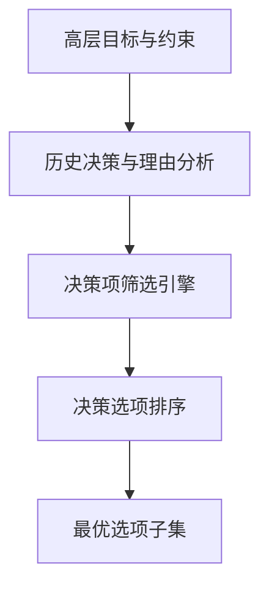

# 高级需求分析模块

## 需求分析的挑战

自动化编程系统在分析用户需求时面临着显著挑战，尤其是处理表面简单但内涵丰富的需求描述时。以"创建一个智能问答系统"这样的简单需求为例，背后隐藏着大量未明确表述的工程与业务需求：

1. **用户身份与场景**：目标用户是谁？使用场景是什么？
2. **领域特定需求**：问答系统针对哪个知识领域？
3. **技术规模要求**：用户活跃量预期？需要多少计算资源？
4. **部署范围**：需要前后端、移动端、APP等多端开发吗？
5. **地域与合规**：系统在哪些国家使用？涉及什么政策约束？
6. **扩展性考虑**：未来需要扩展哪些功能？
7. **技术栈选择**：使用什么编程语言、框架、数据库和模型？
8. **性能平衡**：如何平衡准确度和响应速度？

同样，在架构设计层面，LLM生成的方案往往缺乏足够的技术细节：

1. **框架具体化**：提到使用Python做后端，但未指定REST API框架
2. **实现细节**：提到使用缓存提高响应速度，但未指定缓存框架
3. **并发处理**：未详细说明多线程策略、线程池配置等

## 多层次需求挖掘框架

为解决上述挑战，我们设计了一个多层次需求挖掘框架，作为高级需求分析模块的核心组件。

### 结构化问题分解模型



该模型包含以下核心组件：

1. **领域分类器**：将初始需求自动映射到预定义的应用领域（如问答系统、电商平台等）
2. **问题库管理器**：维护按领域组织的问题集，覆盖业务、功能和技术各层面
3. **动态问题生成器**：基于前序问题的回答动态生成后续问题
4. **需求完整性评估器**：评估当前需求细节的完整性，确定是否需要进一步询问

### 渐进式技术决策流程

```python
class TechDecisionProcess:
    def __init__(self):
        self.tech_dependency_graph = self._load_dependency_graph()
        self.decision_points = {}
        self.reasoning_records = {}
    
    def analyze_tech_requirements(self, requirement_spec):
        """分析需求规范，提取技术决策点"""
        domains = self._identify_tech_domains(requirement_spec)
        for domain in domains:
            self.decision_points[domain] = self._extract_decision_points(domain)
        return self.decision_points
    
    def generate_options(self, decision_point):
        """为特定决策点生成技术选项及其权衡分析"""
        context = self._get_decision_context(decision_point)
        options = self._query_tech_options(decision_point, context)
        analysis = self._generate_tradeoff_analysis(options, context)
        return {"options": options, "analysis": analysis}
    
    def record_decision(self, decision_point, selected_option, reasoning):
        """记录技术决策及其理由"""
        self.reasoning_records[decision_point] = {
            "selected": selected_option,
            "reasoning": reasoning
        }
        # 更新依赖图中的后续决策点
        self._update_dependent_decisions(decision_point, selected_option)
```

## 实施方法

### 双阶段架构设计

为确保需求分析的完整性和架构设计的精确性，我们采用双阶段设计方法：

**第一阶段：全面需求挖掘**
- 从初始需求触发主题相关的核心问题集
- 每个回答触发更具体的子问题
- 形成结构化的需求文档，包含所有必要细节

**第二阶段：细化架构设计**
- 基于完整需求生成高级架构
- 使用决策点标记系统清晰记录每个技术选择
- 为每个决策提供理由和备选方案

示例输出：
```json
{
  "architecture_component": "后端API服务",
  "technology_choice": "Flask",
  "decision_point": {
    "alternatives": ["FastAPI", "Django REST", "Tornado"],
    "reasoning": "考虑到团队熟悉度和项目复杂度中等，选择更成熟、文档更完善的Flask框架",
    "trade_offs": "牺牲了FastAPI的性能优势，获得了更广泛的社区支持和插件生态"
  },
  "implementation_details": {
    "configuration": "使用工厂模式组织应用",
    "extensions": ["Flask-RESTful", "Flask-SQLAlchemy", "Flask-Caching"],
    "deployment": "Gunicorn with gevent workers"
  }
}
```

### 技术选择验证机制

为确保技术选择的一致性和可行性，我们实现了以下验证机制：

1. **上下文依赖检查**：确保相互依赖的技术选择保持一致
   - 例如：选择PostgreSQL后自动考虑对应的ORM和驱动
   - 例如：选择微服务架构后自动考虑服务发现和负载均衡

2. **技术组合可行性评分**：评估技术栈整体的兼容性和可行性
   - 考量因素：版本兼容性、性能特性匹配、部署复杂度
   - 输出：可行性分数和潜在风险提示

3. **架构一致性验证**：确保架构各部分的技术选择相互兼容
   - 检查点：通信协议、数据格式、认证机制等

## 需求-技术映射表

我们构建了详尽的需求与技术实现映射关系，部分示例如下：

| 功能需求 | 技术实现考量 |
|---------|------------|
| 高并发请求处理 | 1. 异步框架选择<br>2. 负载均衡策略<br>3. 数据库连接池配置<br>4. 缓存层设计 |
| 实时数据更新 | 1. WebSocket实现<br>2. 消息队列选择<br>3. 推送机制设计 |
| 大规模数据存储 | 1. 分库分表策略<br>2. NoSQL数据库选型<br>3. 冷热数据分离方案 |
| AI驱动的问答 | 1. 模型部署方式<br>2. 向量数据库选择<br>3. 检索增强生成配置 |

## 集成人机协作模式

我们设计了高效的人机协作模式，平衡自动化与人工专业知识：

### 专家引导式询问

- 系统自动生成关键问题，但允许人类专家进行优先级调整
- 在复杂决策点提供备选方案和权衡分析，由专家做最终决策
- 专家可以添加自定义问题或约束条件进入分析流程

### 增量式架构细化

- 首先生成并确认高层架构框架
- 逐层深入各组件的技术细节
- 为每个组件维护"待决策清单"，确保关键技术选择没有遗漏

## 决策树节点管理与验证

在需求分析和架构设计过程中，决策树的构建是至关重要的。特别需要解决的关键问题是：(1)如何区分决策树中的非叶子节点和叶子节点；(2)如何确保叶子节点的实现可行性和正确性。

### 决策节点分类机制

为了系统化地识别决策树中的节点类型，我们设计了以下分类机制：

```python
class DecisionNodeClassifier:
    def __init__(self, knowledge_base):
        self.knowledge_base = knowledge_base
        self.implementation_patterns = self._load_implementation_patterns()
        
    def classify_node(self, decision_point):
        """确定决策点是叶子节点还是非叶子节点"""
        # 抽象层次评估
        abstraction_score = self._evaluate_abstraction_level(decision_point)
        
        # 技术实现模式匹配
        implementation_confidence = self._match_implementation_patterns(decision_point)
        
        # 依赖关系分析
        dependency_count = self._analyze_dependencies(decision_point)
        
        # 综合评分决定节点类型
        leaf_score = self._calculate_leaf_score(
            abstraction_score, implementation_confidence, dependency_count)
            
        if leaf_score > 0.75:
            return "LEAF_NODE", leaf_score
        elif leaf_score < 0.3:
            return "NON_LEAF_NODE", leaf_score
        else:
            return "AMBIGUOUS", leaf_score, self._generate_clarification_questions(decision_point)
```

分类标准包括：

1. **抽象层次评估**：评估决策点描述的抽象程度
   - 高抽象度（"使用NoSQL数据库"）→ 非叶子节点
   - 低抽象度（"使用MongoDB 4.4，配置WiredTiger存储引擎"）→ 叶子节点

2. **技术实现模式匹配**：与已知可直接实现的技术模式匹配度
   - 高匹配度（符合标准实现模式）→ 叶子节点
   - 低匹配度（需要进一步分解）→ 非叶子节点

3. **依赖关系分析**：评估决策点的内部依赖数量
   - 低依赖（独立组件）→ 叶子节点
   - 高依赖（复合功能）→ 非叶子节点

### 叶子节点验证机制

为确保每个叶子节点都代表可实现且经过验证的组件，我们引入了叶子节点验证机制：



核心验证流程包括：

1. **验证性Demo生成**：
   - 为每个潜在叶子节点自动生成最小可行实现
   - Demo包含基本功能和单元测试
   - 应用最佳实践和设计模式

2. **独立测试环境**：
   - 每个叶子节点在隔离环境中测试
   - 模拟关键依赖，减少外部影响
   - 确保可独立运行和验证

3. **验证标准分级**：
   ```json
   {
     "verification_levels": [
       {
         "level": "L1",
         "description": "通过语法和静态分析",
         "required_tests": ["syntax", "static_analysis"]
       },
       {
         "level": "L2",
         "description": "通过基本功能测试",
         "required_tests": ["unit_tests", "basic_functionality"]
       },
       {
         "level": "L3",
         "description": "通过边缘情况和性能测试",
         "required_tests": ["edge_cases", "performance_benchmarks"]
       }
     ]
   }
   ```

### 渐进式集成策略

为避免将未经充分验证的组件集成导致的后期问题，我们采用渐进式集成策略：

1. **分层集成优先级**：
   - 按功能依赖关系确定集成顺序
   - 核心基础组件优先集成和测试
   - 构建完整依赖图指导集成过程

2. **集成检查点**：
   - 在每个主要集成点设置自动化检查
   - 验证组件间接口一致性
   - 集成测试覆盖关键交互路径

3. **回滚与重组机制**：
   - 检测到集成问题时快速隔离和诊断
   - 维护组件替代方案库，支持快速调整
   - 记录所有集成决策，支持回溯分析

示例集成规划：
```json
{
  "integration_plan": {
    "phase_1": {
      "components": ["core_db_connection", "basic_auth"],
      "dependencies": [],
      "verification_criteria": "L3"
    },
    "phase_2": {
      "components": ["user_api", "data_access_layer"],
      "dependencies": ["phase_1"],
      "verification_criteria": "L2"
    },
    "phase_3": {
      "components": ["advanced_search", "caching_system"],
      "dependencies": ["phase_2"],
      "verification_criteria": "L2"
    }
  }
}
```

### 上下文管理优化

为解决集成测试过程中上下文token消耗过大的问题，我们设计了智能上下文管理策略：

1. **上下文分区**：
   - 将大型决策树划分为相对独立的上下文域
   - 每个域专注于特定功能领域或技术栈
   - 在域内完成验证后再进行跨域集成

2. **可复用验证结果**：
   - 建立验证结果缓存机制
   - 相似组件和配置复用验证结果
   - 增量验证策略，仅验证变更部分

3. **验证状态持久化**：
   - 保存中间验证结果和测试状态
   - 支持会话恢复和继续验证
   - 减少重复生成和验证的token消耗

### 层次化决策筛选机制

在复杂系统设计中，决策树的路径可能非常长，每个节点都可能面临多个决策选项。为了避免决策空间的组合爆炸，我们设计了层次化决策筛选机制，利用高层次目标和上游决策来智能筛选当前节点的决策选项。



#### 目标驱动的选项筛选

1. **目标一致性评分**：
   - 建立每个决策选项与高层目标的一致性评分矩阵
   - 评估决策选项对系统目标的贡献度
   - 筛除与核心目标冲突的选项

   ```python
   def calculate_goal_alignment(decision_options, system_goals):
       """计算决策选项与系统目标的一致性"""
       alignment_scores = {}
       for option in decision_options:
           option_score = 0
           for goal in system_goals:
               contribution = self._evaluate_contribution(option, goal)
               if contribution < -threshold:  # 强负面影响
                   return -1  # 直接排除该选项
               option_score += contribution * goal.weight
           alignment_scores[option] = option_score
       return alignment_scores
   ```

2. **约束传播机制**：
   - 从高层约束推导出当前层面的具体约束
   - 识别并优先考虑满足所有硬约束的选项
   - 对软约束的满足程度进行加权评分

#### 决策历史追踪与利用

1. **决策一致性检查**：
   - 分析已做决策的理由和依据
   - 检查新决策选项是否与已有决策保持技术一致性
   - 标记潜在的决策冲突和矛盾

   ```python
   def check_decision_consistency(new_option, previous_decisions):
       """检查新选项与已有决策的一致性"""
       consistency_issues = []
       for prev_decision, reasoning in previous_decisions.items():
           # 检查技术栈兼容性
           if not self._is_technology_compatible(new_option, prev_decision):
               consistency_issues.append({
                   "type": "technology_incompatibility",
                   "description": f"选项 {new_option} 与已选 {prev_decision} 技术不兼容",
                   "severity": "high"
               })
           # 检查设计原则一致性
           if not self._is_design_principle_consistent(new_option, reasoning):
               consistency_issues.append({
                   "type": "design_principle_inconsistency",
                   "description": f"选项 {new_option} 与决策 {prev_decision} 的设计原则 '{reasoning.principle}' 不一致",
                   "severity": "medium" 
               })
       return consistency_issues
   ```

2. **决策链提取**：
   - 构建从根节点到当前节点的决策路径
   - 分析决策理由之间的关联和递进关系
   - 预测该路径对未来决策的约束和影响

#### 多标准决策评分系统

为处理长决策路径中的复杂选择，我们实现了多标准集成评分系统：

```python
class DecisionOptionRanker:
    def __init__(self, criteria_weights=None):
        self.default_weights = {
            "goal_alignment": 0.35,
            "consistency_with_history": 0.25,
            "implementation_feasibility": 0.20,
            "future_flexibility": 0.10,
            "resource_efficiency": 0.10
        }
        self.criteria_weights = criteria_weights or self.default_weights
    
    def rank_options(self, options, context):
        """对决策选项进行综合排名"""
        scores = {}
        for option in options:
            option_scores = {}
            # 计算各项标准的得分
            option_scores["goal_alignment"] = self._calculate_goal_alignment(option, context)
            option_scores["consistency_with_history"] = self._evaluate_consistency(option, context.previous_decisions)
            option_scores["implementation_feasibility"] = self._assess_feasibility(option)
            option_scores["future_flexibility"] = self._evaluate_flexibility(option)
            option_scores["resource_efficiency"] = self._calculate_efficiency(option)
            
            # 计算加权总分
            total_score = sum(score * self.criteria_weights[criterion] 
                              for criterion, score in option_scores.items())
            scores[option] = {
                "total_score": total_score,
                "breakdown": option_scores,
                "recommendation": self._generate_recommendation(total_score, option_scores)
            }
        
        # 返回排序后的选项
        return sorted(scores.items(), key=lambda x: x[1]["total_score"], reverse=True)
```

#### 适应性决策树修剪

为了进一步优化决策过程，我们实现了自适应决策树修剪策略：

1. **重要性阈值过滤**：
   - 根据当前上下文动态调整重要性阈值
   - 过滤掉低于阈值的次要决策点
   - 集中资源在关键决策上

2. **相似选项合并**：
   - 识别功能和性能特性相近的选项
   - 合并冗余或高度相似的决策选项
   - 提供合并的理由和可能的差异说明

3. **前瞻性评估**：
   - 评估每个决策选项对后续决策树复杂度的影响
   - 预测选择特定选项后的决策树深度和宽度
   - 优先考虑能够简化后续决策的选项

```json
{
  "decision_pruning_example": {
    "original_options_count": 12,
    "after_goal_filtering": 8,
    "after_consistency_check": 5,
    "after_similarity_merging": 3,
    "final_options": [
      {
        "name": "Option A (Merged from A, B, C)",
        "score": 0.92,
        "rationale": "这三个选项在核心功能上相似，差异主要在次要配置上，合并后简化决策"
      },
      {
        "name": "Option D",
        "score": 0.85,
        "rationale": "提供了独特的性能优势，与先前的微服务架构决策高度一致"
      },
      {
        "name": "Option G",
        "score": 0.79,
        "rationale": "虽然得分较低，但提供了重要的未来扩展性，保留作为备选"
      }
    ]
  }
}
```

通过这些机制，我们可以将长决策路径中大量的并行选项智能地筛选为少数几个最佳候选项，大大简化了决策过程，同时确保筛选出的选项与高层目标保持一致，并与已有决策形成连贯的技术路线。这种层次化筛选机制不仅提高了决策效率，还增强了整体架构的一致性和可维护性。

## 结论与未来工作

高级需求分析模块通过结构化的问题分解和技术决策流程，有效解决了简单需求背后复杂细节的挖掘问题。该模块不仅能辅助分析复杂需求，更能生成包含完整技术决策理由的架构设计，大大提高了自动编程系统的实用性。

未来工作将聚焦于以下方向：

1. 扩展领域特定问题库，覆盖更多应用场景
2. 改进技术依赖图的自动更新机制，适应新兴技术栈
3. 开发更精细的需求完整性评估指标
4. 增强与其他模块（如代码生成器、验证环境）的集成能力 