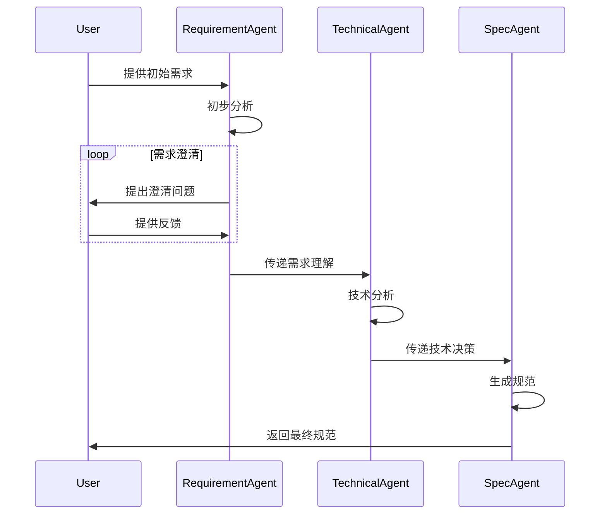
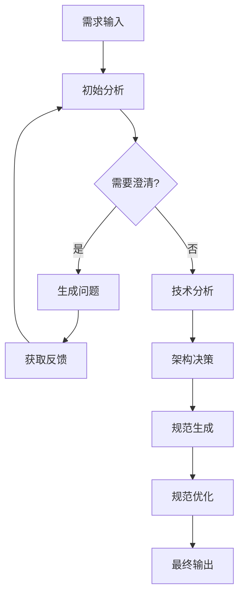

# 高级需求分析设计

## 1. 概述

高级需求分析模块通过集成 Qwen-Agent，实现了更智能的需求理解和分析能力。该模块能够通过多轮对话深入理解用户需求，提供技术决策支持，并生成高质量的规范文档。

## 2. 核心功能

### 2.1 智能对话式需求分析

1. **多轮对话理解**
   - 基于 Qwen-Agent 的对话管理
   - 上下文感知的问题生成
   - 渐进式需求挖掘
   - 需求完整性验证

2. **需求澄清机制**
   - 自动识别模糊点
   - 生成针对性问题
   - 跟踪需求变更
   - 维护需求一致性

### 2.2 深度技术分析

1. **技术栈评估**
   - 自动识别技术约束
   - 分析可行性
   - 推荐最佳实践
   - 评估实现复杂度

2. **架构决策支持**
   - 架构模式匹配
   - 组件关系分析
   - 性能考虑建议
   - 可扩展性评估

### 2.3 智能规范生成

1. **自适应规范模板**
   - 基于领域的模板选择
   - 动态规范结构
   - 自动补充细节
   - 一致性检查

2. **质量保证**
   - 完整性验证
   - 冲突检测
   - 最佳实践符合度
   - 可测试性分析

## 3. 技术实现

### 3.1 需求理解代理

```python
class RequirementUnderstandingAgent:
    def __init__(self):
        self.qwen_agent = QwenAgent(model="requirement_analysis")
        self.context_manager = ContextManager()
        self.knowledge_base = KnowledgeBase()

    async def analyze_requirement(self, text: str) -> Dict[str, Any]:
        """深度需求分析"""
        # 初始理解
        understanding = await self.qwen_agent.understand(text)
        
        # 需求澄清
        clarification_needed = self.identify_unclear_points(understanding)
        if clarification_needed:
            questions = await self.generate_questions(clarification_needed)
            # 等待用户反馈...
        
        # 更新理解
        final_understanding = self.update_understanding(understanding, clarifications)
        return final_understanding

    async def generate_questions(self, unclear_points: List[str]) -> List[str]:
        """生成澄清问题"""
        return await self.qwen_agent.generate_questions(unclear_points)

    def update_understanding(self, current: Dict, new_info: Dict) -> Dict:
        """更新需求理解"""
        return self.context_manager.merge_understanding(current, new_info)
```

### 3.2 技术决策代理

```python
class TechnicalDecisionAgent:
    def __init__(self):
        self.qwen_agent = QwenAgent(model="tech_decision")
        self.tech_knowledge = TechKnowledgeBase()
        
    async def analyze_tech_requirements(self, spec: Dict[str, Any]) -> Dict[str, Any]:
        """技术需求分析"""
        # 提取技术约束
        constraints = await self.extract_constraints(spec)
        
        # 技术选型建议
        tech_suggestions = await self.suggest_tech_stack(constraints)
        
        # 架构建议
        architecture = await self.suggest_architecture(tech_suggestions)
        
        return {
            "constraints": constraints,
            "tech_stack": tech_suggestions,
            "architecture": architecture
        }

    async def suggest_tech_stack(self, constraints: Dict) -> List[Dict]:
        """推荐技术栈"""
        return await self.qwen_agent.analyze_tech_stack(constraints)

    async def suggest_architecture(self, tech_stack: List[Dict]) -> Dict:
        """推荐架构方案"""
        return await self.qwen_agent.design_architecture(tech_stack)
```

### 3.3 规范优化代理

```python
class SpecificationOptimizationAgent:
    def __init__(self):
        self.qwen_agent = QwenAgent(model="spec_optimization")
        self.best_practices = BestPracticesDB()
        
    async def optimize_specification(self, spec: Dict[str, Any]) -> Dict[str, Any]:
        """规范优化"""
        # 完整性检查
        completeness = await self.check_completeness(spec)
        
        # 一致性验证
        consistency = await self.verify_consistency(spec)
        
        # 性能建议
        performance = await self.suggest_performance_improvements(spec)
        
        # 安全性分析
        security = await self.analyze_security(spec)
        
        return self.merge_improvements(spec, completeness, consistency, 
                                    performance, security)

    async def check_completeness(self, spec: Dict) -> Dict:
        """检查规范完整性"""
        return await self.qwen_agent.verify_completeness(spec)

    async def verify_consistency(self, spec: Dict) -> Dict:
        """验证一致性"""
        return await self.qwen_agent.check_consistency(spec)
```

## 4. 工作流程

### 4.1 需求分析流程



### 4.2 决策流程



## 5. 配置示例

### 5.1 代理配置

```yaml
agents:
  requirement_understanding:
    model: "qwen-agent"
    temperature: 0.7
    max_tokens: 2000
    context_window: 10
    
  technical_decision:
    model: "qwen-agent"
    temperature: 0.5
    max_tokens: 1500
    knowledge_base: "tech_stack_v1"
    
  specification_optimization:
    model: "qwen-agent"
    temperature: 0.3
    max_tokens: 1000
    best_practices: "v2.1"
```

### 5.2 知识库配置

```yaml
knowledge_bases:
  domain:
    patterns: "v2.0"
    update_frequency: "daily"
    sources:
      - "internal_docs"
      - "github_trends"
      - "tech_blogs"
  
  technical:
    patterns: "v1.5"
    update_frequency: "weekly"
    sources:
      - "stack_overflow"
      - "github"
      - "tech_papers"
```

## 6. 使用示例

### 6.1 基本使用

```python
async def analyze_requirement(text: str) -> Dict[str, Any]:
    # 初始化代理
    req_agent = RequirementUnderstandingAgent()
    tech_agent = TechnicalDecisionAgent()
    spec_agent = SpecificationOptimizationAgent()
    
    # 需求分析
    understanding = await req_agent.analyze_requirement(text)
    
    # 技术决策
    tech_decisions = await tech_agent.analyze_tech_requirements(understanding)
    
    # 规范优化
    final_spec = await spec_agent.optimize_specification({
        "understanding": understanding,
        "tech_decisions": tech_decisions
    })
    
    return final_spec
```

### 6.2 高级使用

```python
async def advanced_analysis(text: str, context: Dict = None) -> Dict[str, Any]:
    # 初始化分析器
    analyzer = AdvancedRequirementAnalyzer(
        requirement_agent=RequirementUnderstandingAgent(),
        technical_agent=TechnicalDecisionAgent(),
        spec_agent=SpecificationOptimizationAgent(),
        context_manager=ContextManager()
    )
    
    # 设置分析选项
    options = {
        "max_clarification_turns": 3,
        "min_confidence_score": 0.8,
        "enable_deep_analysis": True,
        "include_alternatives": True
    }
    
    # 执行分析
    result = await analyzer.analyze(
        text=text,
        context=context,
        options=options
    )
    
    return result
```

## 7. 测试策略

### 7.1 单元测试

```python
class TestRequirementAgent(unittest.TestCase):
    async def test_requirement_understanding(self):
        agent = RequirementUnderstandingAgent()
        result = await agent.analyze_requirement(
            "创建一个用户认证系统，支持邮箱注册和登录"
        )
        
        self.assertIn("authentication", result["domain"])
        self.assertIn("email", result["features"])
        
    async def test_question_generation(self):
        agent = RequirementUnderstandingAgent()
        questions = await agent.generate_questions(
            ["password_policy", "session_management"]
        )
        
        self.assertTrue(len(questions) > 0)
        self.assertTrue(any("密码" in q for q in questions))
```

### 7.2 集成测试

```python
class TestIntegration(unittest.TestCase):
    async def test_full_workflow(self):
        analyzer = AdvancedRequirementAnalyzer()
        result = await analyzer.analyze(
            "开发一个在线商城系统，支持商品管理和订单处理"
        )
        
        self.assertIn("e-commerce", result["domain"])
        self.assertIn("product_management", result["modules"])
        self.assertIn("order_processing", result["modules"])
```

## 8. 部署考虑

1. **资源需求**
   - CPU: 8+ cores
   - RAM: 16+ GB
   - GPU: 推荐用于模型推理
   - 存储: SSD, 50+ GB

2. **扩展性配置**
   - 负载均衡设置
   - 模型并行处理
   - 分布式部署支持

3. **监控指标**
   - 响应时间
   - 模型调用频率
   - 内存使用
   - 错误率

## 9. 维护和更新

1. **日常维护**
   - 知识库更新
   - 模型微调
   - 性能优化
   - 错误修复

2. **版本更新**
   - 特性添加
   - 架构优化
   - 依赖更新
   - 文档更新

## 10. 安全措施

1. **输入验证**
   - 敏感信息过滤
   - 长度限制
   - 格式验证
   - 注入防护

2. **输出控制**
   - 敏感数据脱敏
   - 结果验证
   - 格式规范化
   - 错误处理
