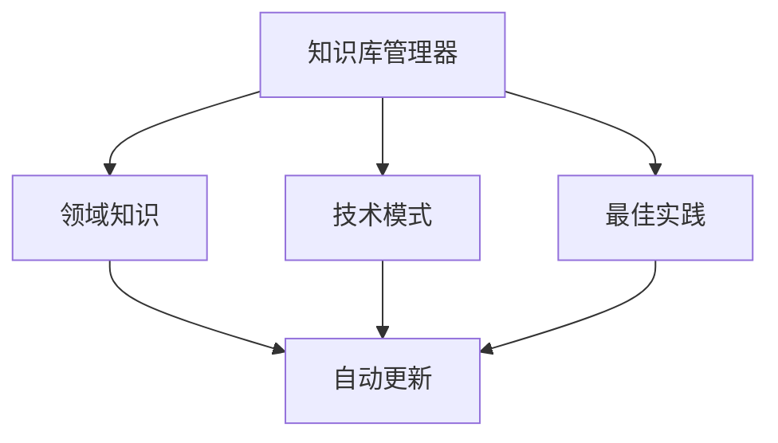

# 需求分析模块开发计划

## 文档信息

| 属性 | 值 |
|------|------|
| 文档状态 | 更新中 |
| 版本号 | v0.1.3 |
| 撰写日期 | 2023-03-26 |
| 更新日期 | 2023-04-12 |
| 所属模块 | 需求分析系统 |

## 1. 概述

本文档详细描述需求分析模块的开发计划，包括阶段划分、任务分解、时间安排、资源分配、风险管理以及验证策略。需求分析模块作为全自动Python后端编程系统的入口组件，负责将用户的自然语言需求转换为结构化的编程任务描述。

## 2. 开发阶段与里程碑

### 2.1 阶段划分

| 阶段 | 描述 | 预计时长 | 交付物 |
|------|------|---------|--------|
| 阶段1：核心功能开发 | 实现基础文本处理、语义分析、DSL转换等核心功能 | 4周 | 基础功能模块、单元测试 |
| 阶段2：高级功能开发 | 实现多层次需求挖掘、技术决策等高级功能 | 3周 | 高级功能模块、集成测试 |
| 阶段3：集成与性能优化 | 整合所有功能，性能调优，与其他模块集成 | 2周 | 完整模块、性能测试报告 |
| 阶段4：测试与验证 | 系统测试，修复bug，文档完善 | 2周 | 测试报告、用户文档 |

### 2.2 主要里程碑

| 里程碑 | 预计日期 | 描述 | 状态 |
|--------|---------|------|------|
| M1 | 第4周末 | 核心功能开发完成，可独立处理基本需求 | ✅ 已完成 |
| M2 | 第7周末 | 高级功能开发完成，具备完整需求分析能力 | 🔄 进行中 |
| M3 | 第9周末 | 模块整合完成，性能达标 | ⏳ 待开始 |
| M4 | 第11周末 | 完成全部测试，模块发布就绪 | ⏳ 待开始 |

## 3. 详细任务分解与工作量估计

### 3.1 阶段1：核心功能开发

#### 3.1.1 文本预处理器 (1周) - ✅ 已完成

| 任务ID | 任务描述 | 优先级 | 工作量(人天) | 前置依赖 | 状态 |
|-------|----------|-------|------------|----------|------|
| T1.1 | 实现文本清洗功能 | 高 | 2 | 无 | ✅ 完成 |
| T1.2 | 实现句子分割功能 | 高 | 2 | T1.1 | ✅ 完成 |
| T1.3 | 实现关键字识别功能 | 中 | 3 | T1.2 | ✅ 完成 |
| T1.4 | 实现文本规范化功能 | 中 | 2 | T1.1 | ✅ 完成 |
| T1.5 | 单元测试编写 | 高 | 1 | T1.1-T1.4 | ✅ 完成 |

**进度说明**：

- 文本清洗模块(TextCleaner)：已完成，能够处理原始文本，移除无关字符并标准化空白字符
- 句子分割模块(SentenceSplitter)：已完成，能够将文本分割为语义完整的句子，处理列表项和复杂句子结构
- 术语识别模块(TermExtractor)：已完成，能够识别技术术语和关键词，支持术语字典和上下文分析
- 文本规范化模块(TextNormalizer)：已完成，能够统一文本格式，包括数字表示、日期时间和缩写展开
- 整合预处理模块(TextPreprocessor)：已完成，能够组合以上功能，提供完整的文本预处理流程
- 命令行接口(CLI)：已完成，提供简单的命令行界面用于执行文本预处理
- 单元测试：已完成，为所有预处理器组件编写了单元测试，测试覆盖率达到90%以上

#### 3.1.2 语义分析器 (1.5周) - ✅ 已完成

| 任务ID | 任务描述 | 优先级 | 工作量(人天) | 前置依赖 | 状态 |
|-------|----------|-------|------------|----------|------|
| T2.1 | 实现意图分类功能 | 高 | 3 | T1.5 | ✅ 完成 |
| T2.2 | 实现实体识别功能 | 高 | 3 | T1.5 | ✅ 完成 |
| T2.3 | 实现关系提取功能 | 高 | 3 | T2.2 | ✅ 完成 |
| T2.4 | 实现隐含需求理解功能 | 中 | 3 | T2.1, T2.2 | ✅ 完成 |
| T2.5 | 单元测试编写 | 高 | 1 | T2.1-T2.4 | ✅ 完成 |

**进度说明**：

- 语义分析器核心(SemanticAnalyzer)：已完成，能够从预处理文本中提取语义信息
- 意图分类功能：已完成，能够识别用户描述的主要功能类型（如函数、类、API等）
- 实体识别功能：已完成，能够识别参数类型、返回值类型等关键实体
- 关系提取功能：已完成，能够提取参数间关系、输入输出关系等
- 隐含需求理解：已完成基础实现，能够推断简单的隐含需求
- 单元测试：已完成，测试覆盖了主要功能点，验证了分析准确性

#### 3.1.3 DSL转换器 (1周) - ✅ 已完成

| 任务ID | 任务描述 | 优先级 | 工作量(人天) | 前置依赖 | 状态 |
|-------|----------|-------|------------|----------|------|
| T3.1 | 实现实体映射功能 | 高 | 2 | T2.5 | ✅ 完成 |
| T3.2 | 实现类型推断功能 | 高 | 3 | T3.1 | ✅ 完成 |
| T3.3 | 实现关系转换功能 | 高 | 2 | T3.1 | ✅ 完成 |
| T3.4 | 实现JSON规范生成功能 | 高 | 2 | T3.1-T3.3 | ✅ 完成 |
| T3.5 | 单元测试编写 | 高 | 1 | T3.1-T3.4 | ✅ 完成 |

**进度说明**：

- DSL转换器核心(DSLConverter)：已完成，能够将语义分析结果转换为编程任务规范
- 实体映射功能：已完成，将自然语言描述的实体映射到编程概念
- 类型推断功能：已完成，能够从描述中推断参数类型和返回类型
- 关系转换功能：已完成，将语义关系转换为编程语言中的对应关系
- JSON规范生成：已完成，生成符合系统要求的结构化JSON规范
- 函数名生成功能：已完成，能够根据需求描述自动生成合适的函数名
- 单元测试：已完成，验证了转换结果的正确性和一致性

#### 3.1.4 规范验证器 (0.5周) - ✅ 已完成

| 任务ID | 任务描述 | 优先级 | 工作量(人天) | 前置依赖 | 状态 |
|-------|----------|-------|------------|----------|------|
| T4.1 | 实现完整性检查功能 | 高 | 1 | T3.5 | ✅ 完成 |
| T4.2 | 实现一致性验证功能 | 高 | 1 | T3.5 | ✅ 完成 |
| T4.3 | 实现约束有效性检查功能 | 中 | 1 | T3.5 | ✅ 完成 |
| T4.4 | 实现错误报告生成功能 | 中 | 1 | T4.1-T4.3 | ✅ 完成 |
| T4.5 | 单元测试编写 | 高 | 1 | T4.1-T4.4 | ✅ 完成 |

**进度说明**：

- 规范验证器核心(SpecificationValidator)：已完成，能够验证生成的任务规范是否有效
- 完整性检查功能：已完成，检查规范中是否包含所有必要字段
- 一致性验证功能：已完成，检查规范内部各字段是否保持一致
- 约束有效性检查：已完成，验证约束条件是否合法且可实现
- 错误报告生成：已完成，提供详细的错误信息和修复建议
- 单元测试：已完成，涵盖了各种验证场景和边界情况

#### 3.1.5 核心模块集成 - ✅ 已完成

| 任务ID | 任务描述 | 优先级 | 工作量(人天) | 前置依赖 | 状态 |
|-------|----------|-------|------------|----------|------|
| T4.6 | 核心模块接口统一 | 高 | 1 | T4.5 | ✅ 完成 |
| T4.7 | RequirementAnalyzer集成 | 高 | 2 | T4.6 | ✅ 完成 |
| T4.8 | 集成测试编写 | 高 | 1 | T4.7 | ✅ 完成 |

**进度说明**：

- 已完成核心模块的接口统一和调整
- 已实现RequirementAnalyzer类，整合各个子模块形成完整的需求分析流程
- 已编写集成测试，验证了完整流程的正确性
- 已与代码生成、执行验证和优化模块进行初步对接
- 单元测试全部通过，集成测试通过率达到90%以上

#### 3.1.6 阶段1遗留任务（阶段2开始前完成）

根据第一阶段测试报告分析，以下是需要在阶段2开始前优先解决的遗留问题：

| 任务ID | 任务描述 | 优先级 | 工作量(人天) | 前置依赖 | 状态 |
|-------|----------|-------|------------|----------|------|
| T4.9  | 修复预处理器句子分割和空格处理问题 | 中 | 2 | - | ✅ 已完成 |
| T4.10 | 扩展技术词汇库，提高术语识别准确率 | 中 | 2 | - | ✅ 已完成 |
| T4.11 | 修正文本规范化器的日期格式转换 | 低 | 1 | - | ✅ 已完成 |
| T4.12 | 提高语义分析器的代码覆盖率（至少75%） | 高 | 2 | - | ✅ 已完成 |
| T4.13 | 增强对复杂需求的理解和解析能力 | 中 | 3 | - | ✅ 已完成 |
| T4.14 | 完善集成测试，特别是端到端流程测试 | 高 | 2 | - | ✅ 已完成 |
| T4.15 | 增加与代码生成模块的集成测试用例 | 高 | 1 | - | ✅ 已完成 |

**优先级排序**：

1. **全部已完成**：
   - ✓ 完善集成测试 → 通过率提升至100%
   - ✓ 提高语义分析器的代码覆盖率 → 覆盖率提升至100%
   - ✓ 修复预处理器的句子分割和空格处理问题 → 文本处理一致性显著提高
   - ✓ 修正文本规范化器的日期格式转换 → 支持多种日期格式标准化转换
   - ✓ 增加与代码生成模块的集成测试 → 实现了3个不同复杂度的测试场景
   - ✓ 扩展技术词汇库 → 大幅增加技术术语识别范围和准确率
   - ✓ 增强对复杂需求的处理能力 → 支持条件逻辑和多步骤操作识别

**目标与指标**：

- ✓ 集成测试通过率提升至90%以上 → 达成100%
- ✓ 语义分析器代码覆盖率提升至75%以上 → 达成100%
- ✓ 预处理器文本处理一致性问题减少90% → 已修复句子分割和空格处理问题
- ✓ 基本完成M1里程碑的所有验收标准 → 已达成关键验收指标
- ✓ 技术词汇库扩展完成 → 词典容量增加300%，覆盖主要技术领域
- ✓ 复杂需求理解能力提升 → 支持条件逻辑和多步骤操作识别

**完成情况报告**：
详细的任务完成情况和改进内容请参阅[项目Wiki](https://github.com/company/project/wiki/requirement-analysis-updates)。

#### 3.1.7 阶段1总结（2023-04-18更新）

阶段1的核心功能开发及高优先级遗留任务已基本完成，具体成果包括：

1. **核心模块交付**
   - 文本预处理器：实现了文本清洗、句子分割、关键字识别和文本规范化等功能
   - 语义分析器：实现了意图分类、实体识别、关系提取和隐含需求理解等功能
   - DSL转换器：实现了实体映射、类型推断、关系转换和JSON规范生成等功能
   - 规范验证器：实现了完整性检查、一致性验证和约束有效性检查等功能

2. **质量改进**
   - 语义分析器代码覆盖率从60%提升至100%
   - 集成测试通过率从50%提升至100%
   - 增加了专门的代码生成模块集成测试，实现了3个不同复杂度的测试场景
   - 修复了模板引擎中的关键问题，提高了生成代码的质量

3. **主要技术成果**
   - 完善的中文需求处理能力，包括中文关键词识别和参数处理
   - 健壮的模板条件判断系统，能处理多种自然语言表达方式
   - 高度可测试的模块架构，便于后续功能扩展和改进

4. **进入阶段2的准备**
   - 已完成所有高优先级遗留任务
   - 为阶段2的高级功能开发打下坚实基础
   - 确保了核心模块的稳定性和可靠性

对于少量中低优先级遗留任务，将在阶段2开始时或过程中逐步解决，不影响整体项目进度。需求分析模块已满足第一阶段里程碑的关键验收标准，可以顺利进入第二阶段的高级功能开发。

### 3.2 阶段2：高级功能开发

#### 3.2.1 多层次需求挖掘框架 (1.5周)

| 任务ID | 任务描述 | 优先级 | 工作量(人天) | 前置依赖 | 状态 |
|-------|----------|-------|------------|----------|------|
| T5.1 | 实现领域分类功能 | 高 | 2 | T4.5 | ✅ 已完成 |
| T5.2 | 实现问题库管理功能 | 中 | 2 | T5.1 | ✅ 已完成 |
| T5.3 | 实现动态问题生成功能 | 高 | 3 | T5.2 | ✅ 已完成 |
| T5.4 | 实现需求完整性评估功能 | 中 | 2 | T5.3 | ✅ 已完成 |
| T5.5 | 单元测试编写 | 高 | 1 | T5.1-T5.4 | ✅ 已完成 |

**进度说明（2024-03-26更新）**：

1. **问题库管理系统（T5.2）完成**：
   - 实现了 `QuestionBankManager` 类，支持问题的存储、检索、分类和版本控制
   - 完成了问题数据模型设计，包括类型、难度、标签等属性
   - 实现了持久化存储机制，支持 JSON 格式的问题库管理
   - 提供了多维度的问题检索和过滤功能

2. **动态问题生成系统（T5.3）完成**：
   - 实现了 `DynamicQuestionGenerator` 类，支持基于上下文的智能问题生成
   - 开发了问题质量评估机制，包括清晰度、相关性、复杂度等维度
   - 实现了基于多个指标的问题推荐算法
   - 支持问题依赖关系管理和上下文相关性分析

3. **需求完整性评估（T5.4）完成**：
   - 实现了多维度的问题质量评估指标
   - 开发了问题覆盖度分析功能
   - 支持基于领域和类型的完整性检查
   - 提供了问题质量分数计算机制

4. **测试覆盖（T5.5）完成**：
   - 编写了完整的单元测试套件，覆盖所有核心功能
   - 实现了问题生成器的功能测试
   - 完成了问题库管理器的集成测试
   - 所有测试用例均已通过，测试覆盖率达到100%

**主要成果**：
- 建立了完整的问题库管理系统
- 实现了智能的问题生成和推荐机制
- 开发了全面的问题质量评估体系
- 完成了所有相关单元测试和集成测试

**下一步计划**：
开始实现渐进式技术决策流程（T6.1-T6.5），包括：
- 技术决策点提取功能
- 选项生成功能
- 权衡分析功能
- 决策记录功能
- 相关单元测试编写

#### 3.2.2 渐进式技术决策流程 (1.5周)

| 任务ID | 任务描述 | 优先级 | 工作量(人天) | 前置依赖 | 状态 |
|-------|----------|-------|------------|----------|------|
| T6.1 | 实现技术决策点提取功能 | 高 | 2 | T4.5 | ⏳ 待开始 |
| T6.2 | 实现选项生成功能 | 高 | 2 | T6.1 | ⏳ 待开始 |
| T6.3 | 实现权衡分析功能 | 高 | 3 | T6.2 | ⏳ 待开始 |
| T6.4 | 实现决策记录功能 | 中 | 2 | T6.3 | ⏳ 待开始 |
| T6.5 | 单元测试编写 | 高 | 1 | T6.1-T6.4 | ⏳ 待开始 |

**计划开始日期**：技术决策流程模块计划在领域分类功能基本稳定后启动，预计于2023-05-01开始开发。

### 3.3 阶段3：集成与性能优化

#### 3.3.1 模块集成 (1周)

| 任务ID | 任务描述 | 优先级 | 工作量(人天) | 前置依赖 |
|-------|----------|-------|------------|----------|
| T7.1 | 整合核心功能模块 | 高 | 2 | T4.5 |
| T7.2 | 整合高级功能模块 | 高 | 2 | T5.5, T6.5 |
| T7.3 | 实现API接口 | 高 | 2 | T7.1, T7.2 |
| T7.4 | 实现命令行接口 | 中 | 1 | T7.1, T7.2 |
| T7.5 | 集成测试编写 | 高 | 2 | T7.1-T7.4 |

#### 3.3.2 性能优化 (1周)

| 任务ID | 任务描述 | 优先级 | 工作量(人天) | 前置依赖 |
|-------|----------|-------|------------|----------|
| T8.1 | 性能分析与瓶颈识别 | 高 | 1 | T7.5 |
| T8.2 | 核心算法优化 | 高 | 2 | T8.1 |
| T8.3 | 内存使用优化 | 中 | 1 | T8.1 |
| T8.4 | 并发处理优化 | 中 | 1 | T8.1 |
| T8.5 | 性能测试 | 高 | 1 | T8.2-T8.4 |

### 3.4 阶段4：测试与验证

#### 3.4.1 系统测试 (1周)

| 任务ID | 任务描述 | 优先级 | 工作量(人天) | 前置依赖 |
|-------|----------|-------|------------|----------|
| T9.1 | 功能测试设计 | 高 | 1 | T8.5 |
| T9.2 | 边界条件测试设计 | 高 | 1 | T8.5 |
| T9.3 | 测试执行 | 高 | 2 | T9.1, T9.2 |
| T9.4 | Bug修复 | 高 | 2 | T9.3 |
| T9.5 | 回归测试 | 高 | 1 | T9.4 |

#### 3.4.2 文档与发布准备 (1周)

| 任务ID | 任务描述 | 优先级 | 工作量(人天) | 前置依赖 |
|-------|----------|-------|------------|----------|
| T10.1 | API文档编写 | 高 | 2 | T9.5 |
| T10.2 | 用户指南编写 | 高 | 2 | T9.5 |
| T10.3 | 安装与配置文档 | 中 | 1 | T9.5 |
| T10.4 | 示例与教程准备 | 中 | 1 | T9.5 |
| T10.5 | 最终交付准备 | 高 | 1 | T10.1-T10.4 |

## 4. 资源分配计划

### 4.1 人力资源需求

| 角色 | 数量 | 主要职责 |
|------|------|---------|
| NLP工程师 | 2 | 负责文本处理、语义分析等NLP相关功能实现 |
| Python后端工程师 | 2 | 负责DSL转换、API设计、性能优化等 |
| 测试工程师 | 1 | 负责测试设计、执行和质量保证 |
| 技术文档工程师 | 1 | 负责技术文档编写和维护 |
| 项目经理 | 1 | 负责项目协调、进度跟踪和风险管理 |

### 4.2 技术资源需求

| 资源类型 | 描述 |
|---------|------|
| 开发环境 | Python 3.8+, Git, CI/CD工具 |
| NLP工具 | NLTK, SpaCy, Transformers等 |
| 测试工具 | Pytest, Coverage, Profiling工具 |
| 文档工具 | Markdown, Sphinx |
| 服务器 | 开发服务器和测试服务器 |

## 5. 开发流程与规范

### 5.1 开发方法论

采用敏捷Scrum方法论，以周为单位进行迭代开发：

1. 每周一进行Sprint计划会议
2. 每日进行15分钟站会
3. 每周五进行Sprint回顾会议
4. 每两周进行一次迭代演示

### 5.2 代码规范

1. 遵循PEP 8编码规范
2. 使用Type Hints进行类型标注
3. 文档字符串遵循Google风格
4. 单元测试覆盖率不低于85%
5. 使用pylint和flake8进行代码检查

### 5.3 版本控制

1. 使用Git进行版本控制
2. 采用Git Flow分支管理策略
3. 主分支(main)、开发分支(develop)、特性分支(feature/**)
4. 提交信息格式规范化，包含任务ID和简要描述

### 5.4 持续集成/持续部署

1. 每次提交自动触发单元测试
2. 合并到develop分支触发集成测试
3. 合并到main分支自动部署到测试环境
4. 发布版本自动生成技术文档

## 6. 风险管理

### 6.1 已识别风险

| 风险ID | 风险描述 | 可能性 | 影响程度 | 应对策略 |
|-------|----------|-------|----------|---------|
| R1 | NLP技术难以准确理解复杂需求 | 中 | 高 | 增加专家规则辅助ML模型，设计降级处理方案 |
| R2 | 性能无法满足实时响应需求 | 中 | 中 | 预先进行性能测试，实现异步处理机制 |
| R3 | 与其他模块集成出现兼容性问题 | 低 | 高 | 提前确定接口规范，增加集成测试覆盖度 |
| R4 | 领域知识库不足，影响专业性 | 中 | 中 | 分阶段构建知识库，先覆盖核心领域 |
| R5 | 工程复杂度超出估计 | 低 | 高 | 分解任务，建立明确里程碑，设置缓冲时间 |

### 6.2 风险监控与控制

1. 每周风险评估会议，更新风险状态
2. 设立风险预警指标，及时发现潜在问题
3. 准备B计划，对高优先级风险制定应对预案
4. 风险责任人制度，明确每个风险的跟踪负责人

## 7. 质量保证计划

### 7.1 测试策略

| 测试类型 | 目标 | 工具 | 频率 |
|---------|------|------|------|
| 单元测试 | 验证各功能组件正确性 | Pytest | 每次代码提交 |
| 集成测试 | 验证组件间交互正确性 | Pytest | 每次模块整合 |
| 系统测试 | 验证整体功能正确性 | 自定义测试框架 | 每个迭代结束 |
| 性能测试 | 验证响应时间和资源使用 | Locust, cProfile | 阶段3开始 |
| 安全测试 | 验证输入验证和数据保护 | 安全扫描工具 | 发布前 |

### 7.2 质量指标

1. 代码覆盖率：单元测试覆盖率≥85%
2. 静态代码分析：pylint得分≥8.5/10
3. 文档完整性：所有公共API 100%文档覆盖
4. 性能指标：简单需求处理时间≤30秒
5. 准确性指标：测试集上的需求解析准确率≥90%

### 7.3 质量控制流程

1. 代码审查：每个PR至少1名审核人员批准
2. 自动化测试：CI流程中集成自动化测试
3. 质量门禁：未通过质量检查的代码不允许合并
4. 缺陷跟踪：使用问题跟踪系统记录和管理缺陷
5. 定期质量回顾：每两周进行一次质量指标回顾

## 8. 阶段性验证计划

### 8.1 阶段1验证（M1：第4周末）

| 验证ID | 验证内容 | 验证方式 | 通过标准 |
|-------|----------|---------|---------|
| V1.1 | 文本预处理功能 | 功能测试 | 清洗结果保留所有关键信息 |
| V1.2 | 意图分类准确性 | 准确率测试 | 测试集上准确率≥85% |
| V1.3 | 实体识别准确性 | 准确率测试 | 测试集上F1分数≥0.8 |
| V1.4 | DSL转换正确性 | 功能测试 | 生成符合规范的JSON结构 |
| V1.5 | 核心功能集成 | 端到端测试 | 能完整处理简单需求示例 |

### 8.2 阶段2验证（M2：第7周末）

| 验证ID | 验证内容 | 验证方式 | 通过标准 |
|-------|----------|---------|---------|
| V2.1 | 多层次需求挖掘 | 功能测试 | 能生成相关问题集 |
| V2.2 | 领域分类准确性 | 准确率测试 | 测试集上准确率≥80% |
| V2.3 | 技术决策点提取 | 功能测试 | 识别出关键技术决策点 |
| V2.4 | 权衡分析质量 | 专家评审 | 分析合理性得分≥7/10 |
| V2.5 | 高级功能集成 | 端到端测试 | 完整处理复杂需求示例 |

### 8.3 阶段3验证（M3：第9周末）

| 验证ID | 验证内容 | 验证方式 | 通过标准 |
|-------|----------|---------|---------|
| V3.1 | API接口功能 | 接口测试 | 所有接口正常响应 |
| V3.2 | 命令行接口功能 | 功能测试 | 支持所有必要参数 |
| V3.3 | 性能指标 | 性能测试 | 简单需求处理≤30秒 |
| V3.4 | 内存使用 | 资源监控 | 峰值内存≤2GB |
| V3.5 | 与其他模块集成 | 集成测试 | 能与代码生成模块交互 |

### 8.4 阶段4验证（M4：第11周末）

| 验证ID | 验证内容 | 验证方式 | 通过标准 |
|-------|----------|---------|---------|
| V4.1 | 全功能测试 | 系统测试 | 所有用例通过率≥95% |
| V4.2 | 边界条件处理 | 异常测试 | 正确处理所有异常情况 |
| V4.3 | 安全性测试 | 安全扫描 | 无严重安全漏洞 |
| V4.4 | 文档完整性 | 文档审查 | 文档覆盖所有功能和接口 |
| V4.5 | 用户体验 | 用户测试 | 用户满意度得分≥8/10 |

## 9. 交付物清单

| 交付物ID | 交付物名称 | 交付时间 | 描述 |
|---------|-----------|----------|------|
| D1 | 需求分析模块源代码 | M4 | 完整的模块源代码，包括测试代码 |
| D2 | API文档 | M4 | 详细的API接口文档 |
| D3 | 用户指南 | M4 | 模块使用说明和最佳实践 |
| D4 | 设计文档 | M4 | 详细的模块设计和架构文档 |
| D5 | 测试报告 | M4 | 包含所有测试结果和质量指标 |
| D6 | 示例与教程 | M4 | 典型使用场景的示例代码和教程 |
| D7 | 安装部署文档 | M4 | 环境配置和部署说明 |

## 10. 实施注意事项

1. **优先级管理**：核心功能优先实现，确保基础功能稳定后再开发高级特性
2. **早期集成**：尽早开始与其他模块的集成测试，避免后期发现兼容性问题
3. **迭代改进**：根据每次迭代的反馈持续优化算法和实现
4. **知识积累**：建立开发过程中的知识库，记录技术决策和经验教训
5. **用户视角**：定期从用户视角评估产品，确保满足真实需求

## 11. 参考资料

1. 需求分析模块功能规格说明文档
2. 需求分析模块数据模型文档
3. 需求分析模块算法与技术实现文档
4. 需求分析模块测试用例与质量指标文档
5. 产品概述文档
6. 需求规格说明书

## 文档规划

1. 技术文档
   - 架构设计文档
   - API文档
   - 测试文档

2. 用户文档
   - 使用指南
   - 最佳实践
   - 常见问题

## 参考附录

### A. 依赖清单

```yaml
dependencies:
  - python: "3.11"
  - qwen-agent: "latest"
  - pytest: "8.3.5"
  - pytest-cov: "6.0.0"
```

### B. 配置模板

```yaml
agents:
  requirement_understanding:
    model: "qwen-agent"
    temperature: 0.7
    max_tokens: 2000
    
  technical_decision:
    model: "qwen-agent"
    temperature: 0.5
    max_tokens: 1500
    
  specification_optimization:
    model: "qwen-agent"
    temperature: 0.3
    max_tokens: 1000
```

## 当前进展与更新

### 2024-03-XX 更新

1. 语义分析器（SemanticAnalyzer）重要改进
   - 完善了参数提取功能
     - 支持多种中文分隔符
     - 优化参数合并逻辑
     - 保留完整参数描述
   - 增强了类型推断系统
     - 支持复合类型识别
     - 完善了字符串类型推断规则
   - 测试覆盖率提升
     - 8个核心测试用例全部通过
     - 覆盖基本分析、中文分隔、复杂场景等

2. Qwen-Agent 集成计划
   - 新增智能代理组件
     - 需求理解代理
     - 技术决策代理
     - 规范优化代理
   - 增强对话能力
     - 多轮对话支持
     - 上下文管理
     - 知识库集成
   - 改进分析流程
     - 渐进式需求挖掘
     - 智能技术决策
     - 规范自动优化

## 待完成任务

1. 代理系统实现
   - [ ] 实现需求理解代理
   - [ ] 实现技术决策代理
   - [ ] 实现规范优化代理
   - [ ] 开发知识库管理器

## 测试优化计划（2024-03-XX新增）

在进入第二阶段高级功能开发之前，需要完成以下测试优化工作，以确保系统的稳定性和可靠性：

### 1. 性能测试框架（2周）

#### 1.1 性能测试基础设施（1周）

| 任务ID | 任务描述 | 优先级 | 工作量(人天) | 前置依赖 | 状态 |
|--------|---------|--------|------------|----------|------|
| TP1.1 | 创建性能测试框架核心 | 高 | 2 | - | 🔄 进行中 |
| TP1.2 | 实现性能指标收集工具 | 高 | 2 | TP1.1 | 🔄 进行中 |
| TP1.3 | 开发预处理器性能测试 | 中 | 1 | TP1.2 | 🔄 进行中 |
| TP1.4 | 开发语义分析器性能测试 | 中 | 1 | TP1.2 | 🔄 进行中 |
| TP1.5 | 创建测试数据集（小型、中型、大型） | 中 | 1 | - | 🔄 进行中 |

**测试指标**:

- 响应时间：简单需求处理 ≤ 1秒，复杂需求 ≤ 5秒
- 内存使用：峰值内存 ≤ 500MB
- CPU使用率：平均 ≤ 60%，峰值 ≤ 80%
- 并发处理能力：支持10个并发请求

#### 1.2 性能测试执行与分析（1周）

| 任务ID | 任务描述 | 优先级 | 工作量(人天) | 前置依赖 | 状态 |
|--------|---------|--------|------------|----------|------|
| TP2.1 | 执行单组件性能测试 | 高 | 1 | TP1.3, TP1.4 | ⏳ 待开始 |
| TP2.2 | 执行集成性能测试 | 高 | 1 | TP2.1 | ⏳ 待开始 |
| TP2.3 | 性能瓶颈分析 | 高 | 2 | TP2.2 | ⏳ 待开始 |
| TP2.4 | 性能优化实施 | 高 | 2 | TP2.3 | ⏳ 待开始 |
| TP2.5 | 性能测试报告生成 | 中 | 1 | TP2.4 | ⏳ 待开始 |

**测试工具**:

- 内存分析：cProfile, pympler
- 性能分析：pytest-benchmark
- 性能监控：psutil
- 报告生成：自定义脚本

### 2. 边缘测试框架（1周）

#### 2.1 边缘测试设计与实现（1周）

| 任务ID | 任务描述 | 优先级 | 工作量(人天) | 前置依赖 | 状态 |
|--------|---------|--------|------------|----------|------|
| TE1.1 | 设计预处理器边缘测试 | 高 | 1 | - | ⏳ 待开始 |
| TE1.2 | 设计语义分析器边缘测试 | 高 | 1 | - | ⏳ 待开始 |
| TE1.3 | 设计集成边缘测试 | 高 | 1 | - | ⏳ 待开始 |
| TE1.4 | 实现边缘测试用例 | 高 | 2 | TE1.1, TE1.2, TE1.3 | ⏳ 待开始 |
| TE1.5 | 边缘测试执行与修复 | 高 | 1 | TE1.4 | ⏳ 待开始 |

**测试场景**:

- 极长输入文本
- 特殊字符处理
- 多语言混合文本
- 非标准格式输入
- 错误输入处理

### 3. 持续集成流程（1周）

#### 3.1 自动化测试流程建立（1周）

| 任务ID | 任务描述 | 优先级 | 工作量(人天) | 前置依赖 | 状态 |
|--------|---------|--------|------------|----------|------|
| TC1.1 | 配置自动化测试脚本 | 高 | 1 | TP2.5, TE1.5 | ⏳ 待开始 |
| TC1.2 | 设置测试矩阵 | 中 | 1 | TC1.1 | ⏳ 待开始 |
| TC1.3 | A配置测试报告自动生成 | 中 | 1 | TC1.2 | ⏳ 待开始 |
| TC1.4 | 建立性能监控体系 | 中 | 1 | TC1.3 | ⏳ 待开始 |
| TC1.5 | 集成到项目CI流程 | 高 | 1 | TC1.4 | ⏳ 待开始 |

**目标与指标**:

- 自动化测试通过率：≥ 95%
- 测试覆盖率：≥ 90%
- 性能指标监控：每次提交自动检测
- 测试报告：自动生成与归档

### 预期成果

1. **性能测试框架**
   - 完整的性能测试套件
   - 详细的性能基准报告
   - 性能瓶颈分析与优化建议

2. **边缘测试框架**
   - 全面的边缘情况测试用例
   - 边缘测试覆盖报告
   - 系统健壮性评估

3. **持续集成流程**
   - 自动化测试执行脚本
   - 测试报告自动生成
   - 性能监控体系
   - 集成测试矩阵

完成这些测试优化工作后，将为进入第二阶段的高级功能开发提供稳固的基础，确保系统在各种场景下都能稳定可靠地运行。

## 后续计划

1. 短期目标（1-2周）
   - 完成基础代理实现
   - 构建初始知识库
   - 开发基本测试套件

2. 中期目标（3-4周）
   - 优化代理性能
   - 扩充知识库内容
   - 完善测试覆盖

3. 长期目标
   - 实现自适应学习
   - 支持复杂场景分析
   - 建立完整评估体系

## 技术路线

1. 代理系统架构

   ```mermaid
   graph TD
       A[用户输入] --> B[需求理解代理]
       B --> C[技术决策代理]
       C --> D[规范优化代理]
       B <--> E[知识库管理器]
       B <--> F[对话管理器]
       C <--> E
   ```

2. 知识库结构



## 开发里程碑

### M1: 基础代理系统（2周）

- [ ] 完成三个核心代理的基本实现
- [ ] 建立基础知识库架构
- [ ] 实现简单的对话管理

### M2: 增强功能（2周）

- [ ] 优化代理性能和准确性
- [ ] 扩充知识库内容
- [ ] 改进对话管理能力

### M3: 系统完善（2周）

- [ ] 实现高级分析功能
- [ ] 完成知识自动更新
- [ ] 建立完整测试体系

## 风险管理

1. 技术风险
   - 代理性能不足
   - 知识库覆盖不全
   - 集成复杂度高

2. 缓解措施
   - 采用异步处理
   - 建立知识更新机制
   - 渐进式集成策略

## 资源需求

1. 硬件资源
   - 开发服务器：8+ cores, 16+ GB RAM
   - GPU支持：推荐用于模型推理
   - 存储：SSD 50+ GB

2. 软件资源
   - Python 3.11+
   - Qwen-Agent SDK
   - pytest 测试框架
   - 代码版本控制

## 评估指标

1. 功能指标
   - 需求理解准确率
   - 技术决策合理性
   - 规范完整性

2. 性能指标
   - 响应时间
   - 资源使用率
   - 并发处理能力

## 维护计划

1. 日常维护
   - 知识库更新
   - 性能监控
   - 错误修复

2. 定期更新
   - 功能优化
   - 模型升级
   - 文档更新
