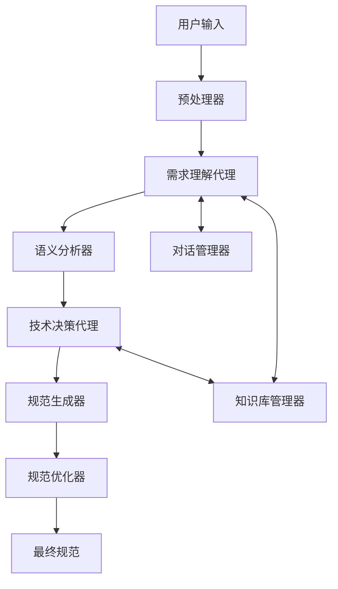

# 需求分析模块架构设计

## 1. 模块概述

需求分析模块是自动编程系统的核心组件之一，负责理解、分析和转换用户的自然语言需求。通过集成 Qwen-Agent，该模块现在具备更强大的对话式需求理解和分析能力。

## 2. 系统架构

### 2.1 核心组件

1. **预处理器 (Preprocessor)**
   - 文本标准化
   - 分词和分句
   - 技术术语识别
   - 上下文信息提取

2. **语义分析器 (SemanticAnalyzer)**
   - 参数提取和类型推断
   - 返回值分析
   - 条件逻辑识别
   - 多步骤操作解析

3. **需求理解代理 (RequirementAgent)**
   - 基于 Qwen-Agent 的智能对话
   - 需求澄清和验证
   - 隐含需求发现
   - 上下文管理

4. **技术决策代理 (TechnicalAgent)**
   - 技术栈分析
   - 架构建议
   - 最佳实践推荐
   - 风险评估

5. **规范生成器 (SpecificationGenerator)**
   - DSL转换
   - 接口定义
   - 约束条件提取
   - 文档生成

### 2.2 辅助组件

1. **知识库管理器 (KnowledgeManager)**
   - 领域知识库
   - 技术模式库
   - 最佳实践库
   - 动态知识更新

2. **对话管理器 (DialogueManager)**
   - 会话状态追踪
   - 上下文维护
   - 多轮对话管理
   - 历史记录保存

3. **规范优化器 (SpecificationOptimizer)**
   - 完整性检查
   - 一致性验证
   - 性能建议
   - 安全性分析

## 3. 数据流



## 4. 关键接口

### 4.1 需求理解代理接口

```python
class RequirementAgent:
    def clarify_requirement(self, text: str) -> Dict[str, Any]:
        """需求澄清和理解"""
        pass

    def analyze_context(self, context: Dict[str, Any]) -> Dict[str, Any]:
        """上下文分析"""
        pass

    def validate_requirement(self, spec: Dict[str, Any]) -> Dict[str, Any]:
        """需求验证"""
        pass
```

### 4.2 技术决策代理接口

```python
class TechnicalAgent:
    def analyze_tech_stack(self, spec: Dict[str, Any]) -> Dict[str, Any]:
        """技术栈分析"""
        pass

    def suggest_architecture(self, requirements: Dict[str, Any]) -> Dict[str, Any]:
        """架构建议"""
        pass

    def assess_risks(self, design: Dict[str, Any]) -> List[Dict[str, Any]]:
        """风险评估"""
        pass
```

## 5. 配置管理

### 5.1 代理配置

```yaml
requirement_agent:
  model: "qwen-agent"
  temperature: 0.7
  max_tokens: 2000
  context_window: 10

technical_agent:
  model: "qwen-agent"
  temperature: 0.5
  max_tokens: 1500
  knowledge_base: "tech_stack_v1"
```

### 5.2 知识库配置

```yaml
knowledge_base:
  domain_patterns: "v2.0"
  tech_patterns: "v1.5"
  best_practices: "v2.1"
  update_frequency: "daily"
```

## 6. 错误处理

1. **对话错误处理**
   - 上下文丢失恢复
   - 会话状态维护
   - 异常响应处理

2. **知识库错误处理**
   - 数据一致性检查
   - 更新冲突解决
   - 缓存管理

3. **代理错误处理**
   - 模型调用重试
   - 超时处理
   - 结果验证

## 7. 性能优化

1. **响应时间优化**
   - 异步处理
   - 结果缓存
   - 批量处理

2. **资源使用优化**
   - 模型调用控制
   - 内存管理
   - 并发控制

## 8. 安全考虑

1. **数据安全**
   - 敏感信息过滤
   - 数据加密存储
   - 访问控制

2. **模型安全**
   - 输入验证
   - 输出过滤
   - 调用限制

## 9. 监控和日志

1. **性能监控**
   - 响应时间跟踪
   - 资源使用监控
   - 错误率统计

2. **日志记录**
   - 对话历史
   - 决策过程
   - 错误追踪

## 10. 扩展性

1. **模型扩展**
   - 支持多种模型
   - 模型版本管理
   - 自定义模型集成

2. **知识库扩展**
   - 新领域支持
   - 知识更新机制
   - 自定义规则添加

## 自然语言处理流程

```python
class NLPAnalyzer:
    def __init__(self):
        self.pipeline = [
            Tokenization(),
            EntityRecognition(
                patterns={
                    'INPUT': r'\b(输入|参数)\b',
                    'OUTPUT': r'\b(输出|返回)\b',
                    'FUNCTION_TYPE': r'\b(创建|开发|实现|设计)\s+[a-z]+(函数|方法|API|服务)',
                    'CONSTRAINTS': r'\b(必须|应该|需要|用|使用)\s+[^\s,]+'
                }
            ),
            IntentClassification()
        ]
    
    def analyze(self, text: str) -> dict:
        results = {}
        for processor in self.pipeline:
            results.update(processor.process(text))
        return self._format_output(results)
        
    def _format_output(self, results: dict) -> dict:
        """将分析结果格式化为标准DSL规范"""
        return {
            "function_type": self._determine_function_type(results),
            "inputs": self._extract_inputs(results),
            "outputs": self._extract_outputs(results),
            "constraints": results.get("CONSTRAINTS", [])
        }
```

## DSL规范示例

系统将自然语言转换为以下结构化格式：

```json
{
  "function_type": "data_processing",
  "inputs": [
    {"name": "raw_data", "type": "List[Dict]", "description": "原始数据列表"}
  ],
  "outputs": {
    "type": "DataFrame",
    "description": "处理后的结构化数据"
  },
  "steps": [
    {"action": "clean_null_values", "params": {"threshold": 0.8}},
    {"action": "normalize_columns", "params": {"columns": ["price", "quantity"]}}
  ],
  "constraints": [
    "使用pandas库",
    "处理过程不应修改原始数据"
  ]
}
```

## 需求分类

系统支持以下几类需求的分析：

1. **数据处理函数**：处理、转换和清洗数据
2. **API端点**：实现Web服务接口
3. **算法实现**：搜索、排序、优化等算法
4. **工具函数**：辅助功能和通用工具
5. **数据库操作**：查询、存储和检索数据

## 功能类型推断

系统通过关键词和上下文分析确定所需功能的类型：

| 关键词 | 推断功能类型 |
|-------|------------|
| "处理CSV/JSON/数据" | 数据处理函数 |
| "API/端点/服务" | Web API端点 |
| "算法/排序/搜索" | 算法实现 |
| "数据库/存储/查询" | 数据库操作 |

## 约束提取

系统识别并提取以下类型的约束条件：

1. **技术栈约束**：如"使用FastAPI"、"基于SQLAlchemy"
2. **性能约束**：如"必须在O(n)时间内完成"
3. **设计约束**：如"遵循SOLID原则"、"采用工厂模式"
4. **兼容性约束**：如"支持Python 3.8及以上版本"

## 输入/输出类型推断

系统基于上下文自动推断参数和返回值的类型：

```python
def infer_type(description: str) -> str:
    """根据描述推断Python类型"""
    type_patterns = {
        r'\b(列表|数组|list)\b': 'List',
        r'\b(字典|dict|map|映射)\b': 'Dict',
        r'\b(字符串|string|文本)\b': 'str',
        r'\b(整数|int|integer|数字)\b': 'int',
        r'\b(浮点|float|小数)\b': 'float',
        r'\b(布尔|bool|boolean|真假)\b': 'bool',
        r'\b(dataframe|表格|数据帧)\b': 'DataFrame'
    }
    
    for pattern, type_name in type_patterns.items():
        if re.search(pattern, description, re.I):
            return type_name
    
    return 'Any'  # 默认类型
```

## 错误处理

系统实现了健壮的错误处理机制：

1. **歧义检测**：识别和解决需求中的歧义
2. **信息不足处理**：检测并请求缺失信息
3. **异常情况**：处理格式错误和无法解析的需求
