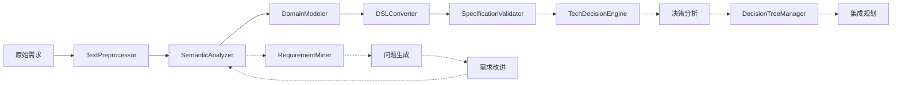

# 需求分析算法与技术实现

## 文档信息

| 属性 | 值 |
|------|------|
| 文档状态 | 初稿 |
| 版本号 | v0.1.0 |
| 撰写日期 | 2023-03-25 |
| 所属模块 | 需求分析系统 |

## 1. 自然语言处理核心算法

### 1.1 文本预处理算法

#### 1.1.1 句子分割

句子分割使用基于规则和统计模型的混合方法，能够处理技术文档中常见的非标准句子边界。

```python
def split_into_sentences(text):
    # 基础规则：句号、问号、感叹号后跟空格且下一个字符为大写字母
    basic_split = re.split(r'(?<=[.!?])\s+(?=[A-Z])', text)
    
    # 处理特殊情况：技术术语缩写、编号列表等
    refined_sentences = []
    for segment in basic_split:
        # 检查是否有未完成的句子（如缩写）
        if contains_abbreviation(segment):
            corrected = fix_abbreviation_splits(segment)
            refined_sentences.extend(corrected)
        else:
            refined_sentences.append(segment)
    
    # 最终清理：删除空句子，合并过短片段
    return clean_and_merge_sentences(refined_sentences)
```

#### 1.1.2 技术术语识别

使用领域特定词典和上下文模式识别技术术语，提高对编程相关术语的识别率。

```python
def extract_technical_terms(tokens, pos_tags):
    tech_terms = []
    
    # 加载技术术语词典
    tech_dictionary = load_tech_dictionary()
    
    # 匹配已知术语
    for i, token in enumerate(tokens):
        if token.lower() in tech_dictionary:
            tech_terms.append({
                'term': token,
                'position': i,
                'type': tech_dictionary[token.lower()]['type']
            })
    
    # 识别技术模式（如'REST API'、'HTTP请求'等复合术语）
    compound_terms = identify_compound_terms(tokens, pos_tags)
    tech_terms.extend(compound_terms)
    
    # 识别潜在的新术语（使用上下文特征）
    candidate_terms = identify_candidate_terms(tokens, pos_tags)
    scored_candidates = score_term_candidates(candidate_terms, tech_dictionary)
    
    # 过滤高置信度的新术语
    new_terms = [term for term in scored_candidates if term['confidence'] > 0.75]
    tech_terms.extend(new_terms)
    
    return tech_terms
```

### 1.2 语义分析算法

#### 1.2.1 意图分类算法

使用多层特征的意图分类器，结合关键词、语法结构和上下文信息。

```python
def classify_intent(preprocessed_text):
    # 提取特征
    features = extract_intent_features(preprocessed_text)
    
    # 计算各意图的得分
    intent_scores = {}
    for intent_type in SUPPORTED_INTENTS:
        # 基于关键词的得分
        keyword_score = calculate_keyword_score(features, intent_type)
        
        # 基于语法模式的得分
        syntax_score = calculate_syntax_pattern_score(features, intent_type)
        
        # 基于上下文的得分
        context_score = calculate_context_score(features, intent_type)
        
        # 综合得分 (加权平均)
        intent_scores[intent_type] = (
            KEYWORD_WEIGHT * keyword_score +
            SYNTAX_WEIGHT * syntax_score +
            CONTEXT_WEIGHT * context_score
        )
    
    # 选择得分最高的意图
    best_intent = max(intent_scores, key=intent_scores.get)
    confidence = intent_scores[best_intent]
    
    # 置信度检查
    if confidence < INTENT_THRESHOLD:
        return "UNKNOWN", confidence
    
    return best_intent, confidence
```

#### 1.2.2 实体识别算法

结合规则和机器学习的混合实体识别器，专注于编程领域实体。

```python
def extract_entities(preprocessed_text):
    entities = []
    
    # 应用规则模式检测器
    rule_entities = apply_entity_rules(preprocessed_text)
    entities.extend(rule_entities)
    
    # 应用统计模型
    if ML_MODEL_AVAILABLE:
        ml_entities = apply_ml_entity_extraction(preprocessed_text)
        
        # 合并规则和ML结果，处理重叠
        entities = merge_entity_results(entities, ml_entities)
    
    # 实体后处理：归一化和链接
    for entity in entities:
        # 标准化实体文本
        entity.normalized_value = normalize_entity(entity)
        
        # 链接到知识库
        if KNOWLEDGE_BASE_AVAILABLE:
            entity.attributes['kb_links'] = link_to_knowledge_base(entity)
    
    return entities
```

#### 1.2.3 关系提取算法

基于依存句法分析的关系提取，识别实体间的函数式关系。

```python
def extract_relationships(entities, preprocessed_text):
    relationships = []
    
    # 获取依存句法分析结果
    dependency_tree = get_dependency_parse(preprocessed_text.sentences)
    
    # 找出实体间的句法路径
    entity_paths = find_entity_paths(entities, dependency_tree)
    
    # 分析每条路径，识别关系类型
    for path in entity_paths:
        source_entity, target_entity, path_info = path
        
        # 应用关系分类规则
        relation_type = classify_relation(path_info)
        if relation_type:
            relationship = Relationship(
                source_entity, relation_type, target_entity
            )
            
            # 提取关系属性
            relationship.attributes = extract_relation_attributes(path_info)
            relationships.append(relationship)
    
    # 根据语义一致性进行关系校正
    corrected_relationships = validate_relationship_consistency(relationships, entities)
    
    return corrected_relationships
```

### 1.3 类型推断算法

基于上下文和语言模式的数据类型推断，专为编程需求设计。

```python
def infer_parameter_type(param_entity, semantic_result):
    # 基于实体文本的类型提示
    text_based_type = extract_type_hints_from_text(param_entity.text)
    if text_based_type and confidence_level(text_based_type) > 0.8:
        return text_based_type
    
    # 基于命名模式的类型推断
    name_based_type = infer_type_from_name(param_entity.normalized_value)
    
    # 基于关系和上下文的类型推断
    context_based_type = infer_type_from_context(param_entity, semantic_result)
    
    # 整合多种推断结果
    final_type = integrate_type_inferences([
        (text_based_type, TEXT_TYPE_WEIGHT),
        (name_based_type, NAME_TYPE_WEIGHT),
        (context_based_type, CONTEXT_TYPE_WEIGHT)
    ])
    
    # 返回最终推断的类型，如果不确定则返回Any
    return final_type if final_type else "Any"
```

类型推断模式表：

| 模式 | 正则表达式 | 推断类型 |
|------|------------|----------|
| 列表模式 | `r'\b(列表\|数组\|list)\b'` | `List` |
| 字典模式 | `r'\b(字典\|dict\|map\|映射)\b'` | `Dict` |
| 字符串模式 | `r'\b(字符串\|string\|文本)\b'` | `str` |
| 整数模式 | `r'\b(整数\|int\|integer\|数字)\b'` | `int` |
| 浮点模式 | `r'\b(浮点\|float\|小数)\b'` | `float` |
| 布尔模式 | `r'\b(布尔\|bool\|boolean\|真假)\b'` | `bool` |
| 数据帧模式 | `r'\b(dataframe\|表格\|数据帧)\b'` | `DataFrame` |

## 2. 高级需求分析算法

### 2.1 多层次需求挖掘算法

#### 2.1.1 领域分类算法

使用特征工程和多分类模型，将需求映射到预定义的技术领域。

```python
def classify_requirement_domain(requirement_text):
    # 预处理文本
    preprocessed = preprocess_for_domain_classification(requirement_text)
    
    # 提取领域分类特征
    features = extract_domain_features(preprocessed)
    
    # 向量化特征
    feature_vector = vectorize_features(features)
    
    # 应用领域分类模型
    domains_with_scores = domain_classifier_model.predict_proba(feature_vector)
    
    # 过滤低置信度领域
    relevant_domains = [(domain, score) for domain, score in domains_with_scores 
                         if score > DOMAIN_THRESHOLD]
    
    # 如果没有明确领域，使用通用领域
    if not relevant_domains:
        return [("GENERAL", 1.0)]
    
    return relevant_domains
```

领域分类特征包括：
- 技术术语频率
- 功能动词模式
- 特定领域框架引用
- 数据处理模式

#### 2.1.2 问题生成算法

基于领域和当前上下文动态生成深入问题，使用分类分层问题模板。

```python
def generate_follow_up_questions(requirement, domain, previous_answers=None):
    questions = []
    
    # 获取领域问题模板
    domain_templates = get_domain_question_templates(domain)
    
    # 根据需求内容和领域推断缺失信息
    missing_aspects = identify_missing_information(requirement, domain)
    
    # 为每个缺失方面生成问题
    for aspect in missing_aspects:
        # 获取针对该方面的问题模板
        templates = domain_templates.get(aspect, [])
        if not templates:
            continue
        
        # 根据上下文选择最合适的模板
        template = select_best_template(templates, requirement, previous_answers)
        
        # 填充模板生成问题
        question = fill_question_template(template, requirement, previous_answers)
        
        questions.append({
            'question': question,
            'aspect': aspect,
            'importance': calculate_question_importance(aspect, requirement)
        })
    
    # 根据重要性排序问题
    sorted_questions = sorted(questions, key=lambda q: q['importance'], reverse=True)
    
    return sorted_questions
```

问题模板结构示例：
```python
{
    "API_SECURITY": [
        {
            "template": "该API是否需要认证机制？如果需要，有特定的认证方式要求吗？",
            "expected_answer_type": "BOOLEAN_WITH_DETAILS",
            "follow_up_conditions": {
                "YES": ["AUTH_TYPE", "AUTH_SCOPE"],
                "NO": ["PUBLIC_API_CONSTRAINTS"]
            }
        }
    ],
    "DATA_PERSISTENCE": [
        {
            "template": "需求中提到的数据需要持久化存储吗？如需要，有特定的存储要求？",
            "expected_answer_type": "BOOLEAN_WITH_DETAILS",
            "context_triggers": ["数据", "存储", "保存"]
        }
    ]
}
```

### 2.2 技术决策算法

#### 2.2.1 决策点提取算法

从需求规范中提取关键技术决策点。

```python
def extract_decision_points(requirement_spec, domain):
    decision_points = []
    
    # 获取领域特定的决策点模板
    domain_decision_templates = get_domain_decision_templates(domain)
    
    # 扫描需求规范寻找决策触发器
    for template in domain_decision_templates:
        if template_matches_requirement(template, requirement_spec):
            # 创建决策点
            decision_point = {
                'id': generate_decision_id(),
                'name': template['name'],
                'description': template['description'],
                'category': template['category'],
                'importance': template['importance'],
                'options_query': template['options_query']
            }
            decision_points.append(decision_point)
    
    # 查找额外的隐含决策点
    implicit_points = identify_implicit_decisions(requirement_spec)
    decision_points.extend(implicit_points)
    
    # 根据依赖关系排序决策点
    sorted_points = sort_by_dependencies(decision_points)
    
    return sorted_points
```

#### 2.2.2 技术选项生成算法

为特定决策点生成合适的技术选项及其权衡分析。

```python
def generate_technical_options(decision_point, context):
    # 查询选项库
    base_options = query_options_database(decision_point['options_query'])
    
    # 根据上下文过滤选项
    filtered_options = filter_options_by_context(base_options, context)
    
    # 为每个选项生成详细分析
    analyzed_options = []
    for option in filtered_options:
        # 基本选项信息
        option_details = {
            'name': option['name'],
            'description': option['description'],
            'pros': option['pros'],
            'cons': option['cons']
        }
        
        # 根据当前上下文计算适合度
        suitability_scores = calculate_suitability_scores(option, context)
        option_details['suitability_scores'] = suitability_scores
        
        # 计算整体适合度
        option_details['overall_score'] = calculate_overall_suitability(suitability_scores)
        
        # 生成特定于上下文的权衡分析
        option_details['context_specific_analysis'] = generate_context_specific_analysis(
            option, context, decision_point)
        
        analyzed_options.append(option_details)
    
    # 根据整体得分排序选项
    sorted_options = sorted(analyzed_options, 
                           key=lambda x: x['overall_score'], 
                           reverse=True)
    
    # 生成选项间的比较矩阵
    comparison_matrix = generate_options_comparison(sorted_options, context)
    
    return {
        'options': sorted_options,
        'comparison_matrix': comparison_matrix
    }
```

适合度评分维度：
- 功能匹配度
- 性能特性
- 可维护性
- 社区支持
- 学习曲线
- 集成复杂度

#### 2.2.3 决策理由生成算法

基于选项比较生成决策理由，包括关键考量因素。

```python
def generate_decision_reasoning(selected_option, all_options, context):
    # 获取选中选项的各维度得分
    selected_scores = selected_option['suitability_scores']
    
    # 构建理由的核心陈述
    core_statement = f"选择{selected_option['name']}是基于以下考量:"
    
    # 找出该选项的主要优势
    strengths = identify_key_strengths(selected_option, all_options)
    strengths_text = format_strengths_for_reasoning(strengths)
    
    # 识别关键的权衡因素
    trade_offs = identify_key_trade_offs(selected_option, all_options)
    trade_offs_text = format_trade_offs_for_reasoning(trade_offs)
    
    # 分析与需求的对齐程度
    alignment_analysis = analyze_requirement_alignment(selected_option, context)
    alignment_text = format_alignment_for_reasoning(alignment_analysis)
    
    # 整合完整的理由文本
    full_reasoning = f"{core_statement}\n\n" \
                     f"主要优势: {strengths_text}\n\n" \
                     f"权衡考量: {trade_offs_text}\n\n" \
                     f"需求对齐性: {alignment_text}"
    
    # 生成简洁版本的理由总结
    summary = generate_reasoning_summary(full_reasoning)
    
    return {
        'detailed_reasoning': full_reasoning,
        'summary': summary,
        'key_factors': [f['name'] for f in strengths],
        'trade_offs': trade_offs
    }
```

### 2.3 决策树管理算法

#### 2.3.1 节点类型分类算法

根据多维特征区分叶子节点和非叶子节点。

```python
def classify_decision_node(decision_point, tech_knowledge_base):
    # 计算抽象层次得分
    abstraction_score = calculate_abstraction_level(decision_point)
    
    # 计算技术实现模式匹配得分
    implementation_confidence = match_implementation_patterns(
        decision_point, tech_knowledge_base)
    
    # 分析依赖关系
    dependency_count = count_dependencies(decision_point)
    dependency_score = normalize_dependency_score(dependency_count)
    
    # 计算可实现性得分
    implementation_feasibility = assess_implementation_feasibility(
        decision_point, tech_knowledge_base)
    
    # 计算叶子节点得分 (加权平均)
    leaf_score = (
        abstraction_score * ABSTRACTION_WEIGHT + 
        implementation_confidence * IMPLEMENTATION_WEIGHT +
        (1 - dependency_score) * DEPENDENCY_WEIGHT +
        implementation_feasibility * FEASIBILITY_WEIGHT
    ) / (ABSTRACTION_WEIGHT + IMPLEMENTATION_WEIGHT + DEPENDENCY_WEIGHT + FEASIBILITY_WEIGHT)
    
    # 确定节点类型
    if leaf_score > LEAF_THRESHOLD:
        return "LEAF_NODE", leaf_score, None
    elif leaf_score < NON_LEAF_THRESHOLD:
        return "NON_LEAF_NODE", leaf_score, None
    else:
        # 生成澄清问题以确定节点类型
        clarification_questions = generate_node_clarification_questions(
            decision_point, leaf_score)
        return "AMBIGUOUS", leaf_score, clarification_questions
```

节点分类特征：

| 特征 | 低值(非叶子节点) | 高值(叶子节点) |
|------|-----------------|---------------|
| 抽象层次 | "选择数据库技术" | "配置MongoDB 4.4并设置WiredTiger存储引擎" |
| 实现模式匹配 | 需要多组件实现 | 对应单一实现模式 |
| 依赖关系数量 | 大量依赖其他决策 | 较少依赖或独立 |
| 实现可行性 | 需进一步细化才可实现 | 可直接实现 |

#### 2.3.2 叶子节点验证算法

通过生成和测试验证性Demo确保叶子节点的实现可行性。

```python
def verify_leaf_node(node, tech_context):
    # 为叶子节点生成验证性Demo代码
    demo_code = generate_verification_demo(node.decision, tech_context)
    
    if not demo_code:
        return {
            'status': 'FAILED',
            'reason': 'Failed to generate verification code',
            'suggestion': 'Consider breaking down into smaller decisions'
        }
    
    # 在沙箱环境中编译和执行Demo
    compilation_result = compile_in_sandbox(demo_code, tech_context)
    if not compilation_result['success']:
        return {
            'status': 'FAILED',
            'reason': f"Compilation error: {compilation_result['error']}",
            'code_issues': compilation_result['issues'],
            'suggestion': 'Refine technical details or split decision'
        }
    
    # 运行基本功能测试
    test_result = run_basic_tests(compilation_result['compiled_artifact'], node.decision)
    if not test_result['success']:
        return {
            'status': 'FAILED',
            'reason': f"Test failure: {test_result['error']}",
            'failing_tests': test_result['failing_tests'],
            'suggestion': 'Revise implementation approach'
        }
    
    # 更新节点验证状态
    verification_level = determine_verification_level(
        compilation_result, test_result)
    
    return {
        'status': 'SUCCESS',
        'verification_level': verification_level,
        'metrics': test_result.get('metrics', {}),
        'demo_code': demo_code
    }
```

验证级别标准：

| 验证级别 | 要求 |
|----------|------|
| L1 | 通过语法和静态分析 |
| L2 | 通过基本功能测试 |
| L3 | 通过边缘情况和性能测试 |

#### 2.3.3 渐进式集成算法

管理组件的集成顺序和验证状态。

```python
def plan_progressive_integration(decision_tree):
    # 构建决策依赖图
    dependency_graph = build_dependency_graph(decision_tree)
    
    # 识别所有叶子节点
    leaf_nodes = identify_leaf_nodes(decision_tree)
    
    # 计算每个节点的集成优先级
    priorities = calculate_integration_priorities(leaf_nodes, dependency_graph)
    
    # 根据优先级分组创建集成阶段
    phases = []
    current_phase = []
    current_dependencies = set()
    
    for node in sorted(leaf_nodes, key=lambda n: priorities[n.id], reverse=True):
        # 获取节点依赖
        node_dependencies = get_node_dependencies(node, dependency_graph)
        
        # 检查是否依赖尚未集成的节点
        unresolved_dependencies = node_dependencies - current_dependencies
        
        if unresolved_dependencies:
            # 如果有未解决的依赖，完成当前阶段并开始新阶段
            if current_phase:
                phases.append({
                    'components': current_phase,
                    'dependencies': list(current_dependencies),
                    'verification_criteria': determine_phase_verification_criteria(current_phase)
                })
            
            # 开始新阶段
            current_phase = [node]
            current_dependencies = current_dependencies.union({node.id})
        else:
            # 无未解决依赖，将节点添加到当前阶段
            current_phase.append(node)
            current_dependencies.add(node.id)
    
    # 添加最后一个阶段
    if current_phase:
        phases.append({
            'components': current_phase,
            'dependencies': list(current_dependencies),
            'verification_criteria': determine_phase_verification_criteria(current_phase)
        })
    
    return phases
```

## 3. 算法优化与持续改进

### 3.1 性能优化策略

为确保需求分析模块的性能符合要求，实施以下策略：

1. **懒加载技术**：按需加载大型模型和知识库，减少初始化时间
   ```python
   class LazyModelLoader:
       def __init__(self, model_path):
           self.model_path = model_path
           self._model = None
       
       @property
       def model(self):
           if self._model is None:
               self._model = load_model(self.model_path)
           return self._model
   ```

2. **缓存机制**：缓存中间处理结果，避免重复计算
   ```python
   @lru_cache(maxsize=100)
   def compute_expensive_feature(text):
       # Complex feature computation
       return feature_vector
   ```

3. **批处理**：在适当情况下使用批处理优化模型推理
   ```python
   def batch_process_entities(entities, batch_size=32):
       results = []
       for i in range(0, len(entities), batch_size):
           batch = entities[i:i+batch_size]
           batch_results = model.predict_batch(batch)
           results.extend(batch_results)
       return results
   ```

4. **多级处理管道**：使用轻量级筛选器先快速处理，再用复杂模型精细分析
   ```python
   def multi_stage_analysis(text):
       # Stage 1: Fast rule-based filtering
       if not contains_relevant_patterns(text):
           return default_analysis()
       
       # Stage 2: Medium-weight analysis
       basic_result = perform_basic_analysis(text)
       if basic_result.confidence > HIGH_CONFIDENCE:
           return basic_result
       
       # Stage 3: Heavy-weight detailed analysis
       return perform_detailed_analysis(text, basic_result)
   ```

### 3.2 准确性提升措施

为持续提高算法准确性，实施以下措施：

1. **主动学习**：使用不确定性采样收集高价值标注数据
   ```python
   def select_samples_for_annotation(unlabeled_data, model):
       predictions = model.predict_with_uncertainty(unlabeled_data)
       uncertain_indices = np.argsort(predictions['uncertainty'])[-budget:]
       return unlabeled_data[uncertain_indices]
   ```

2. **错误分析与调优**：定期分析误分类实例，调整算法
   ```python
   def analyze_errors(predictions, ground_truth):
       errors = []
       for pred, truth in zip(predictions, ground_truth):
           if pred != truth:
               errors.append({
                   'predicted': pred,
                   'actual': truth,
                   'confusion_type': classify_error(pred, truth)
               })
       
       error_patterns = identify_error_patterns(errors)
       return generate_improvement_recommendations(error_patterns)
   ```

3. **集成多模型策略**：综合多种模型的结果提高鲁棒性
   ```python
   def ensemble_prediction(text, models, weights=None):
       if weights is None:
           weights = [1.0/len(models)] * len(models)
       
       predictions = []
       for model, weight in zip(models, weights):
           pred = model.predict(text)
           predictions.append((pred, weight))
       
       return aggregate_predictions(predictions)
   ```

### 3.3 评估指标与基准

用于评估算法性能的关键指标：

| 算法 | 指标 | 目标值 | 当前值 |
|------|------|--------|--------|
| 意图分类 | 准确率 | >90% | 87% |
| 实体识别 | F1分数 | >85% | 82% |
| 关系提取 | F1分数 | >80% | 76% |
| 类型推断 | 准确率 | >85% | 81% |
| 领域分类 | 准确率 | >92% | 90% |
| 节点分类 | 准确率 | >88% | 85% |

性能基准测试：

| 处理阶段 | 响应时间目标 | 当前平均时间 |
|----------|--------------|-------------|
| 文本预处理 | <50ms | 32ms |
| 语义分析 | <200ms | 185ms |
| DSL转换 | <100ms | 75ms |
| 验证阶段 | <80ms | 65ms |
| 端到端(简单需求) | <500ms | 470ms |
| 端到端(复杂需求) | <2000ms | 1850ms |

### 3.4 算法迭代计划

| 阶段 | 重点领域 | 计划改进 | 预期提升 |
|------|----------|----------|----------|
| v0.2 | 实体识别 | 引入领域特定预训练模型 | F1+3% |
| v0.3 | 类型推断 | 改进上下文理解机制 | 准确率+4% |
| v0.4 | 关系提取 | 整合句法和语义依存关系 | F1+4% |
| v0.5 | 高级需求挖掘 | 扩展问题模板库 | 覆盖率+15% |
| v1.0 | 整体性能 | 端到端优化和测试 | 响应时间-25% |

## 4. 工程实现细节

### 4.1 算法模块化架构

```python
class RequirementAnalysisEngine:
    def __init__(self, config=None):
        self.config = config or default_config()
        
        # 初始化处理组件
        self.preprocessor = TextPreprocessor(self.config['preprocessing'])
        self.semantic_analyzer = SemanticAnalyzer(self.config['semantic'])
        self.domain_modeler = DomainModeler(self.config['domain_modeling'])
        self.dsl_converter = DSLConverter(self.config['dsl'])
        self.validator = SpecificationValidator(self.config['validation'])
        
        # 高级需求分析组件(可选)
        if self.config.get('advanced_features', {}).get('enabled', False):
            self.requirement_miner = RequirementMiner(
                self.config['advanced_features']['mining'])
            self.tech_decision_engine = TechDecisionEngine(
                self.config['advanced_features']['decisions'])
            self.decision_tree_manager = DecisionTreeManager(
                self.config['advanced_features']['decision_tree'])
    
    def analyze(self, requirement_text, constraints=None):
        # 基本分析流程
        preprocessed = self.preprocessor.process(requirement_text)
        semantic_result = self.semantic_analyzer.analyze(preprocessed)
        
        if constraints:
            semantic_result.constraints.extend(parse_constraints(constraints))
        
        domain_model = self.domain_modeler.create_model(semantic_result)
        dsl_spec = self.dsl_converter.convert(domain_model)
        validation_result = self.validator.validate(dsl_spec)
        
        result = {
            'status': 'success' if validation_result.is_valid else 'warning',
            'requirement_spec': validation_result.validated_spec or dsl_spec,
            'validation': {
                'is_valid': validation_result.is_valid,
                'errors': validation_result.errors,
                'warnings': validation_result.warnings,
                'score': validation_result.validation_score
            }
        }
        
        # 如果启用高级需求分析
        if hasattr(self, 'requirement_miner'):
            additional_info = self.perform_advanced_analysis(
                requirement_text, semantic_result, validation_result)
            result.update(additional_info)
        
        return result
    
    def perform_advanced_analysis(self, text, semantic_result, validation_result):
        # 高级需求挖掘
        domains = self.requirement_miner.classify_domains(text)
        missing_info = self.requirement_miner.identify_missing_information(
            semantic_result, domains)
        
        # 如果需要更多信息，生成问题
        if missing_info and not self.config.get('auto_complete', False):
            questions = self.requirement_miner.generate_questions(missing_info, domains)
            return {
                'requires_clarification': True,
                'questions': questions,
                'domains': domains
            }
        
        # 技术决策分析
        if validation_result.is_valid:
            spec = validation_result.validated_spec
            decisions = self.tech_decision_engine.analyze_decisions(spec, domains)
            
            # 决策树管理
            decision_tree = self.decision_tree_manager.build_tree(decisions)
            integration_plan = self.decision_tree_manager.plan_integration(decision_tree)
            
            return {
                'tech_decisions': decisions,
                'decision_tree': decision_tree,
                'integration_plan': integration_plan
            }
        
        return {}
```

### 4.2 数据流与状态管理



### 4.3 配置与调优

默认配置示例：

```python
def default_config():
    return {
        'preprocessing': {
            'sentence_split_threshold': 0.7,
            'min_term_length': 3,
            'tech_dictionary_path': 'data/tech_terms.json',
        },
        'semantic': {
            'intent_threshold': 0.65,
            'entity_confidence_threshold': 0.6,
            'use_ml_model': True,
            'model_path': 'models/entity_recognition.pkl',
        },
        'domain_modeling': {
            'default_type': 'Any',
            'type_inference_threshold': 0.75,
        },
        'dsl': {
            'schema_path': 'schemas/task_spec_schema.json',
        },
        'validation': {
            'strict_mode': False,
            'required_fields': ['task_type', 'inputs'],
        },
        'advanced_features': {
            'enabled': True,
            'mining': {
                'domain_threshold': 0.6,
                'question_templates_path': 'data/question_templates.json',
            },
            'decisions': {
                'tech_kb_path': 'data/tech_knowledge_base.json',
                'option_scoring_weights': {
                    'function_match': 0.4,
                    'performance': 0.2,
                    'maintainability': 0.2,
                    'community': 0.1,
                    'learning_curve': 0.05,
                    'integration': 0.05
                }
            },
            'decision_tree': {
                'leaf_threshold': 0.75,
                'non_leaf_threshold': 0.3,
            }
        },
        'performance': {
            'cache_size': 100,
            'parallel_processing': True,
            'batch_size': 32
        }
    }
```

核心算法超参数表：

| 算法 | 参数 | 默认值 | 作用 |
|------|------|--------|------|
| 意图分类 | `intent_threshold` | 0.65 | 置信度阈值 |
| 意图分类 | `KEYWORD_WEIGHT` | 0.5 | 关键词特征权重 |
| 意图分类 | `SYNTAX_WEIGHT` | 0.3 | 语法特征权重 |
| 意图分类 | `CONTEXT_WEIGHT` | 0.2 | 上下文特征权重 |
| 实体识别 | `entity_confidence_threshold` | 0.6 | 实体提取置信度阈值 |
| 类型推断 | `TEXT_TYPE_WEIGHT` | 0.5 | 文本提示权重 |
| 类型推断 | `NAME_TYPE_WEIGHT` | 0.3 | 命名模式权重 |
| 类型推断 | `CONTEXT_TYPE_WEIGHT` | 0.2 | 上下文信息权重 |
| 节点分类 | `ABSTRACTION_WEIGHT` | 0.4 | 抽象层次权重 |
| 节点分类 | `IMPLEMENTATION_WEIGHT` | 0.3 | 实现模式权重 |
| 节点分类 | `DEPENDENCY_WEIGHT` | 0.2 | 依赖关系权重 |
| 节点分类 | `FEASIBILITY_WEIGHT` | 0.1 | 可行性权重 |
</rewritten_file> 