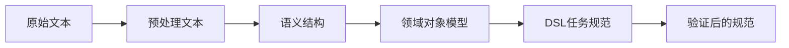

# 需求分析模块数据模型

## 文档信息

| 属性 | 值 |
|------|------|
| 文档状态 | 初稿 |
| 版本号 | v0.1.0 |
| 撰写日期 | 2023-03-25 |
| 所属模块 | 需求分析系统 |

## 1. 数据流概述

需求分析模块涉及多层次的数据转换过程，从原始文本输入到结构化任务描述的整个流程如下图所示：



每个阶段的数据模型在结构和抽象程度上都有所不同，以适应特定处理阶段的需求。

## 2. 核心数据模型

### 2.1 预处理文本模型

原始需求文本经过预处理后的结构化表示。

```python
class PreprocessedText:
    """预处理后的文本模型"""
    
    def __init__(self, original_text: str):
        self.original_text = original_text
        self.sentences = []        # 分割后的句子列表
        self.tokens = []           # 分词结果
        self.tagged_tokens = []    # 带词性标注的token
        self.technical_terms = []  # 识别出的技术术语
        self.metadata = {}         # 文本元数据，如语言、长度等
```

### 2.2 语义分析结果模型

表示文本经过语义分析后提取的意图和实体。

```python
class SemanticAnalysisResult:
    """语义分析结果模型"""
    
    def __init__(self):
        self.intent = None         # 主要意图，如"创建函数"，"实现API"等
        self.intent_confidence = 0.0  # 意图识别的置信度
        self.entities = []         # 识别的实体列表
        self.relationships = []    # 实体间的关系
        self.constraints = []      # 提取的约束条件
        self.uncertain_elements = []  # 不确定的元素，可能需要进一步澄清
```

实体模型:

```python
class Entity:
    """语义实体模型"""
    
    def __init__(self, entity_type, text, start_pos, end_pos):
        self.entity_type = entity_type  # 实体类型，如INPUT, OUTPUT, FUNCTION_TYPE
        self.text = text                # 原始文本
        self.start_pos = start_pos      # 开始位置
        self.end_pos = end_pos          # 结束位置
        self.attributes = {}            # 附加属性
        self.normalized_value = None    # 规范化后的值
```

关系模型:

```python
class Relationship:
    """实体间关系模型"""
    
    def __init__(self, source_entity, relation_type, target_entity):
        self.source = source_entity    # 源实体
        self.target = target_entity    # 目标实体
        self.relation_type = relation_type  # 关系类型，如HAS_PARAM, RETURNS
        self.attributes = {}           # 关系属性
```

### 2.3 领域对象模型

基于语义分析结果构建的特定领域对象，更符合编程概念。

```python
class FunctionModel:
    """函数领域模型"""
    
    def __init__(self, name=None, description=None):
        self.name = name              # 函数名称
        self.description = description # 函数描述
        self.parameters = []          # 参数列表
        self.return_value = None      # 返回值
        self.functionality = []       # 功能描述
        self.constraints = []         # 约束条件
        self.complexity = None        # 复杂度估计
```

参数模型:

```python
class ParameterModel:
    """函数参数模型"""
    
    def __init__(self, name=None, description=None):
        self.name = name              # 参数名
        self.description = description # 参数描述
        self.data_type = None         # 推断的数据类型
        self.is_optional = False      # 是否可选
        self.default_value = None     # 默认值
        self.constraints = []         # 参数约束
```

API端点模型:

```python
class APIEndpointModel:
    """API端点领域模型"""
    
    def __init__(self, path=None, description=None):
        self.path = path              # API路径
        self.description = description # 端点描述
        self.method = None            # HTTP方法
        self.request_body = None      # 请求体模型
        self.response = None          # 响应模型
        self.query_params = []        # 查询参数
        self.path_params = []         # 路径参数
        self.auth_required = False    # 是否需要认证
        self.rate_limit = None        # 速率限制
```

### 2.4 DSL任务规范模型

最终转换为代码生成模块可处理的DSL格式。

```python
class TaskSpecification:
    """任务规范模型"""
    
    def __init__(self, task_type=None):
        self.task_type = task_type    # 任务类型
        self.inputs = []              # 输入定义
        self.outputs = None           # 输出定义
        self.steps = []               # 处理步骤
        self.constraints = []         # 约束条件
        self.metadata = {}            # 元数据
    
    def to_json(self):
        """转换为JSON表示"""
        return json.dumps(self.__dict__, default=lambda o: o.__dict__)
    
    @classmethod
    def from_json(cls, json_str):
        """从JSON创建实例"""
        pass
```

约束模型:

```python
class Constraint:
    """约束条件模型"""
    
    def __init__(self, constraint_type, description):
        self.constraint_type = constraint_type  # 约束类型
        self.description = description          # 约束描述
        self.priority = 1                      # 优先级 (1-5)
        self.is_hard_constraint = True         # 是否为硬约束
        self.source = None                     # 约束来源
```

### 2.5 验证结果模型

记录需求规范验证的结果。

```python
class ValidationResult:
    """验证结果模型"""
    
    def __init__(self, is_valid=False):
        self.is_valid = is_valid      # 是否有效
        self.errors = []              # 错误列表
        self.warnings = []            # 警告列表
        self.suggestions = []         # 改进建议
        self.validation_score = 0.0   # 验证分数(0-1)
        self.validated_spec = None    # 验证后的规范
```

## 3. 高级需求分析数据模型

### 3.1 多层次需求挖掘模型

```python
class RequirementTree:
    """需求树模型"""
    
    def __init__(self, root_requirement):
        self.root = root_requirement  # 根需求
        self.sub_requirements = []    # 子需求列表
        self.requirement_depth = 1    # 需求树深度
        self.completion_score = 0.0   # 完整性评分
```

问题模型:

```python
class Question:
    """需求问题模型"""
    
    def __init__(self, text, question_type):
        self.text = text              # 问题文本
        self.question_type = question_type  # 问题类型
        self.expected_answer_type = None    # 期望的回答类型
        self.importance = 1           # 重要性 (1-5)
        self.domain = None            # 问题所属领域
        self.dependencies = []        # 依赖的问题
```

### 3.2 技术决策模型

```python
class TechnicalDecision:
    """技术决策模型"""
    
    def __init__(self, decision_point, options=None):
        self.decision_point = decision_point  # 决策点，如"数据库选择"
        self.options = options or []         # 可选项列表
        self.selected_option = None          # 选定的选项
        self.reasoning = None                # 决策理由
        self.confidence = 0.0                # 置信度
        self.implications = []               # 该决策的影响
        self.trade_offs = {}                 # 权衡分析
```

选项模型:

```python
class TechnicalOption:
    """技术选项模型"""
    
    def __init__(self, name, description):
        self.name = name              # 选项名称
        self.description = description # 选项描述
        self.pros = []                # 优点列表
        self.cons = []                # 缺点列表
        self.suitability_score = 0.0  # 适合度分数
        self.references = []          # 参考资料
```

### 3.3 决策树模型

```python
class DecisionTree:
    """决策树模型"""
    
    def __init__(self, root_decision):
        self.root = root_decision     # 根决策
        self.nodes = {}               # 决策节点映射
        self.edges = []               # 决策依赖边
        self.leaf_nodes = []          # 叶子节点列表
        self.current_path = []        # 当前决策路径
```

节点模型:

```python
class DecisionNode:
    """决策节点模型"""
    
    def __init__(self, node_id, decision):
        self.id = node_id             # 节点ID
        self.decision = decision      # 关联的决策
        self.node_type = None         # 节点类型 (非叶子/叶子)
        self.abstraction_level = 0.0  # 抽象级别 (0-1)
        self.verification_status = None  # 验证状态
        self.children = []            # 子节点
        self.parent = None            # 父节点
```

## 4. 数据转换流程

### 4.1 文本预处理到语义分析

文本预处理阶段将原始文本转换为结构化的预处理文本模型，然后语义分析器将其转换为语义分析结果:

```python
def preprocess_to_semantic(text: str) -> SemanticAnalysisResult:
    # 创建预处理文本模型
    preprocessed = PreprocessedText(text)
    
    # 执行预处理操作
    preprocessed.sentences = split_into_sentences(text)
    preprocessed.tokens = tokenize(text)
    preprocessed.tagged_tokens = tag_parts_of_speech(preprocessed.tokens)
    preprocessed.technical_terms = extract_technical_terms(preprocessed.tokens)
    
    # 执行语义分析
    semantic_result = SemanticAnalysisResult()
    semantic_result.intent = classify_intent(preprocessed)
    semantic_result.entities = extract_entities(preprocessed)
    semantic_result.relationships = extract_relationships(semantic_result.entities)
    semantic_result.constraints = extract_constraints(preprocessed)
    
    return semantic_result
```

### 4.2 语义分析到领域模型

语义分析结果被转换为特定领域的对象模型:

```python
def semantic_to_domain_model(semantic_result: SemanticAnalysisResult):
    # 根据意图选择合适的领域模型
    if semantic_result.intent == "CREATE_FUNCTION":
        return build_function_model(semantic_result)
    elif semantic_result.intent == "IMPLEMENT_API":
        return build_api_model(semantic_result)
    elif semantic_result.intent == "DATA_PROCESSING":
        return build_data_processing_model(semantic_result)
    else:
        raise ValueError(f"Unsupported intent: {semantic_result.intent}")
```

构建函数模型的示例:

```python
def build_function_model(semantic_result: SemanticAnalysisResult) -> FunctionModel:
    function = FunctionModel()
    
    # 提取函数名和描述
    for entity in semantic_result.entities:
        if entity.entity_type == "FUNCTION_NAME":
            function.name = entity.normalized_value
        elif entity.entity_type == "FUNCTION_DESCRIPTION":
            function.description = entity.text
    
    # 提取参数
    for entity in semantic_result.entities:
        if entity.entity_type == "PARAMETER":
            param = ParameterModel(name=entity.normalized_value)
            param.description = get_parameter_description(entity, semantic_result)
            param.data_type = infer_parameter_type(entity, semantic_result)
            function.parameters.append(param)
    
    # 提取返回值
    for entity in semantic_result.entities:
        if entity.entity_type == "RETURN_VALUE":
            function.return_value = build_return_value_model(entity, semantic_result)
    
    # 提取约束
    function.constraints = semantic_result.constraints
    
    return function
```

### 4.3 领域模型到DSL规范

领域模型被进一步转换为DSL任务规范:

```python
def domain_model_to_dsl(domain_model):
    # 根据领域模型类型选择合适的转换器
    if isinstance(domain_model, FunctionModel):
        return function_to_dsl(domain_model)
    elif isinstance(domain_model, APIEndpointModel):
        return api_to_dsl(domain_model)
    else:
        raise ValueError(f"Unsupported domain model type: {type(domain_model)}")
```

函数模型到DSL的转换示例:

```python
def function_to_dsl(function: FunctionModel) -> TaskSpecification:
    spec = TaskSpecification(task_type="function")
    
    # 设置元数据
    spec.metadata["name"] = function.name
    spec.metadata["description"] = function.description
    
    # 转换参数为输入
    for param in function.parameters:
        input_spec = {
            "name": param.name,
            "type": param.data_type,
            "description": param.description,
            "optional": param.is_optional
        }
        if param.default_value:
            input_spec["default"] = param.default_value
        spec.inputs.append(input_spec)
    
    # 设置输出
    if function.return_value:
        spec.outputs = {
            "type": function.return_value.data_type,
            "description": function.return_value.description
        }
    
    # 转换约束
    for constraint in function.constraints:
        spec.constraints.append(constraint.description)
    
    return spec
```

### 4.4 DSL规范验证

DSL规范经过验证后形成最终输出:

```python
def validate_dsl_spec(spec: TaskSpecification) -> ValidationResult:
    validation = ValidationResult()
    
    # 验证任务类型
    if not spec.task_type:
        validation.errors.append("Missing task type")
    
    # 验证输入
    if not spec.inputs:
        validation.warnings.append("No inputs specified")
    else:
        for input_spec in spec.inputs:
            if "name" not in input_spec:
                validation.errors.append("Input missing name")
            if "type" not in input_spec:
                validation.warnings.append(f"Input {input_spec.get('name', 'unknown')} missing type")
    
    # 验证输出
    if not spec.outputs:
        validation.warnings.append("No outputs specified")
    elif "type" not in spec.outputs:
        validation.warnings.append("Output missing type")
    
    # 验证约束
    if not spec.constraints:
        validation.suggestions.append("Consider adding constraints for better code generation")
    
    # 设置验证状态
    validation.is_valid = len(validation.errors) == 0
    
    # 计算验证分数
    total_checks = 5  # 基本检查数
    passed_checks = total_checks - len(validation.errors) - (len(validation.warnings) * 0.5)
    validation.validation_score = max(0.0, min(1.0, passed_checks / total_checks))
    
    # 如果有效，保存验证后的规范
    if validation.is_valid:
        validation.validated_spec = spec
    
    return validation
```

## 5. 数据持久化

### 5.1 数据存储格式

系统支持以下格式存储需求分析数据:

1. **JSON格式**: 用于API接口和文件存储
2. **数据库记录**: 用于持久化和查询
3. **内存缓存**: 用于临时数据和会话状态

### 5.2 数据库模式

如果使用关系数据库，数据库模式如下:

```sql
-- 需求表
CREATE TABLE requirements (
    id SERIAL PRIMARY KEY,
    original_text TEXT NOT NULL,
    intent VARCHAR(50),
    created_at TIMESTAMP DEFAULT CURRENT_TIMESTAMP,
    updated_at TIMESTAMP DEFAULT CURRENT_TIMESTAMP
);

-- 实体表
CREATE TABLE entities (
    id SERIAL PRIMARY KEY,
    requirement_id INTEGER REFERENCES requirements(id),
    entity_type VARCHAR(50) NOT NULL,
    original_text TEXT NOT NULL,
    normalized_value TEXT,
    metadata JSONB
);

-- 关系表
CREATE TABLE relationships (
    id SERIAL PRIMARY KEY,
    source_entity_id INTEGER REFERENCES entities(id),
    target_entity_id INTEGER REFERENCES entities(id),
    relation_type VARCHAR(50) NOT NULL,
    metadata JSONB
);

-- DSL规范表
CREATE TABLE task_specifications (
    id SERIAL PRIMARY KEY,
    requirement_id INTEGER REFERENCES requirements(id),
    spec_data JSONB NOT NULL,
    validation_score FLOAT,
    is_valid BOOLEAN,
    created_at TIMESTAMP DEFAULT CURRENT_TIMESTAMP
);

-- 技术决策表
CREATE TABLE technical_decisions (
    id SERIAL PRIMARY KEY,
    requirement_id INTEGER REFERENCES requirements(id),
    decision_point VARCHAR(100) NOT NULL,
    selected_option VARCHAR(100),
    reasoning TEXT,
    confidence FLOAT,
    metadata JSONB
);
```

## 6. 错误处理

### 6.1 错误类型定义

```python
class RequirementAnalysisError(Exception):
    """需求分析错误基类"""
    pass

class PreprocessingError(RequirementAnalysisError):
    """预处理阶段错误"""
    pass

class SemanticAnalysisError(RequirementAnalysisError):
    """语义分析阶段错误"""
    pass

class DomainModelingError(RequirementAnalysisError):
    """领域建模阶段错误"""
    pass

class DSLConversionError(RequirementAnalysisError):
    """DSL转换阶段错误"""
    pass

class ValidationError(RequirementAnalysisError):
    """验证阶段错误"""
    pass
```

### 6.2 错误记录和处理

```python
def handle_requirement_error(error, context):
    """处理需求分析过程中的错误"""
    # 记录错误
    logger.error(f"Error during requirement analysis: {str(error)}")
    logger.debug(f"Error context: {context}")
    
    # 生成用户友好的错误消息
    user_message = generate_user_friendly_message(error)
    
    # 尝试恢复或提供修复建议
    recovery_actions = suggest_recovery_actions(error, context)
    
    return {
        "error_type": type(error).__name__,
        "error_message": str(error),
        "user_message": user_message,
        "recovery_suggestions": recovery_actions
    }
```

## 7. 序列化和反序列化

为了支持数据的持久化和传输，所有模型类都实现了序列化和反序列化方法:

```python
class ModelBase:
    """所有数据模型的基类"""
    
    def to_dict(self):
        """将模型转换为字典"""
        result = {}
        for key, value in self.__dict__.items():
            if key.startswith('_'):
                continue
            if isinstance(value, ModelBase):
                result[key] = value.to_dict()
            elif isinstance(value, list):
                result[key] = [item.to_dict() if isinstance(item, ModelBase) else item for item in value]
            else:
                result[key] = value
        return result
    
    def to_json(self):
        """将模型转换为JSON字符串"""
        return json.dumps(self.to_dict())
    
    @classmethod
    def from_dict(cls, data):
        """从字典创建模型实例"""
        instance = cls()
        for key, value in data.items():
            setattr(instance, key, value)
        return instance
    
    @classmethod
    def from_json(cls, json_str):
        """从JSON字符串创建模型实例"""
        data = json.loads(json_str)
        return cls.from_dict(data)
```

## 8. 数据模型验证

为确保数据模型的完整性和一致性，每个模型类都实现了验证方法:

```python
def validate(self):
    """验证模型的完整性和一致性"""
    errors = []
    warnings = []
    
    # 执行特定于模型的验证逻辑
    self._validate_model(errors, warnings)
    
    return {
        "is_valid": len(errors) == 0,
        "errors": errors,
        "warnings": warnings
    }
```

这些验证方法在数据转换过程中被调用，以确保每个阶段的输出都是有效的。 