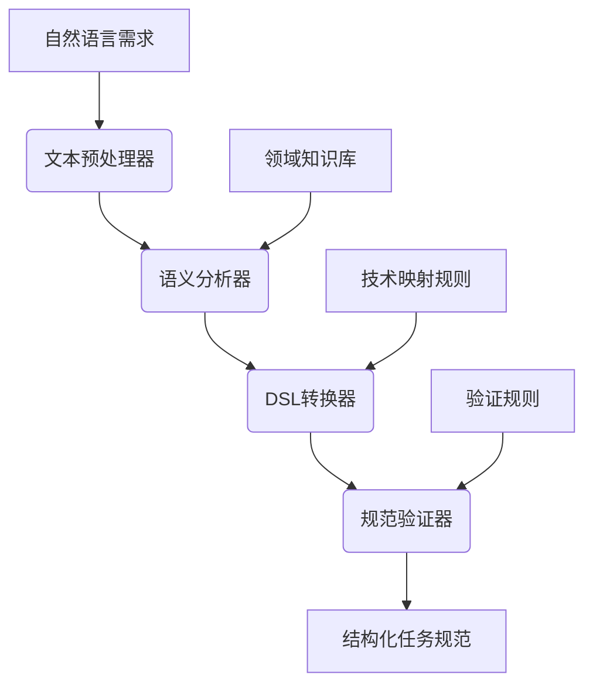

# 需求分析模块功能规格说明

## 文档信息

| 属性 | 值 |
|------|------|
| 文档状态 | 初稿 |
| 版本号 | v0.1.0 |
| 撰写日期 | 2023-03-25 |
| 所属模块 | 需求分析系统 |

## 1. 模块概述

需求分析模块是全自动Python后端编程系统的入口组件，负责将用户的自然语言需求转换为结构化的编程任务描述。该模块融合了自然语言处理和软件工程领域知识，实现了从文本到任务规范的智能转换。

## 2. 功能架构

需求分析模块由以下子组件组成：



## 3. 核心组件说明

### 3.1 文本预处理器

**功能目标**: 清洗和标准化输入的自然语言文本，为后续分析做准备。

**主要功能**:
- 文本清洗：移除无关字符、标准化空白字符
- 句子分割：将文本分割为语义完整的句子
- 关键字识别：标记可能的技术术语和关键词
- 文本规范化：统一格式，如数字表示、单位等

**输入/输出规范**:
- 输入：原始自然语言文本
- 输出：预处理后的标准化文本列表，带有初步标记

**实现要点**:
- 使用正则表达式进行基础文本清洗
- 利用NLP库进行句子划分和词性标注
- 维护技术术语词典用于关键词识别

### 3.2 语义分析器

**功能目标**: 理解需求文本的核心意图和实体关系，提取关键信息。

**主要功能**:
- 意图分类：识别需求的主要目的（创建函数、实现API等）
- 实体识别：提取关键实体，如输入参数、返回值、功能描述
- 关系提取：分析实体间的关系，如数据流向、约束条件
- 理解隐含需求：基于上下文推断未明确表述的需求

**输入/输出规范**:
- 输入：预处理后的文本
- 输出：语义分析结果，包含意图、实体及其关系

**实现要点**:
- 使用实体识别模型提取关键信息
- 利用意图分类器确定需求类型
- 通过依存关系分析理解实体间关系
- 集成领域知识库辅助分析

### 3.3 DSL转换器

**功能目标**: 将语义分析结果转换为结构化的领域特定语言表示。

**主要功能**:
- 实体映射：将识别的实体映射到DSL模式
- 类型推断：根据上下文推断数据类型
- 关系转换：将语义关系转换为DSL中的结构关系
- 生成JSON规范：输出符合预定义模式的JSON结构

**输入/输出规范**:
- 输入：语义分析结果
- 输出：符合系统规范的JSON格式任务描述

**实现要点**:
- 定义严格的DSL语法规则
- 实现类型推断算法
- 构建语义分析结果到DSL的映射规则
- 支持多种常见编程任务的模板

**DSL结构示例**:
```json
{
  "function_type": "data_processing",
  "inputs": [
    {"name": "raw_data", "type": "List[Dict]", "description": "原始数据列表"}
  ],
  "outputs": {
    "type": "DataFrame",
    "description": "处理后的结构化数据"
  },
  "steps": [
    {"action": "clean_null_values", "params": {"threshold": 0.8}},
    {"action": "normalize_columns", "params": {"columns": ["price", "quantity"]}}
  ],
  "constraints": [
    "使用pandas库",
    "处理过程不应修改原始数据"
  ]
}
```

### 3.4 规范验证器

**功能目标**: 确保生成的任务规范完整且一致，符合代码生成模块的输入要求。

**主要功能**:
- 完整性检查：验证所有必要字段都已填充
- 一致性验证：检查规范内部逻辑是否一致
- 约束有效性：确认所有约束条件都是可执行的
- 错误报告：生成详细的问题报告和修复建议

**输入/输出规范**:
- 输入：初步生成的DSL规范
- 输出：验证后的规范，附带验证报告

**实现要点**:
- 定义规范验证规则集
- 实现规则检查引擎
- 提供修复建议算法
- 维护验证状态记录

## 4. 高级需求分析功能

### 4.1 多层次需求挖掘框架

**功能目标**: 深入分析简单需求背后的复杂技术细节，挖掘隐含需求。

**主要功能**:
- 领域分类：将需求自动映射到预定义应用领域
- 问题库管理：维护按领域组织的专业问题集
- 动态问题生成：基于上下文生成深入探究的问题
- 需求完整性评估：评估当前需求细节的完整性

**实现方法**:
- 建立应用领域分类模型
- 设计按领域组织的问题模板库
- 实现问题生成算法，分析回答生成后续问题
- 开发需求完整性评分机制

### 4.2 渐进式技术决策流程

**功能目标**: 基于需求自动进行技术选择，并记录决策理由。

**主要功能**:
- 技术决策点提取：从需求中识别关键技术决策点
- 选项生成：为每个决策点生成合理的技术选项
- 权衡分析：分析各选项的优缺点和适用条件
- 决策记录：记录选择结果和决策理由

**技术决策处理流程**:
```python
# 伪代码示例
def tech_decision_process(requirement_spec):
    # 识别技术领域
    domains = identify_tech_domains(requirement_spec)
    
    # 提取决策点
    decision_points = {}
    for domain in domains:
        decision_points[domain] = extract_decision_points(domain)
    
    # 为每个决策点生成选项和分析
    for point in decision_points:
        context = get_decision_context(point)
        options = query_tech_options(point, context)
        analysis = generate_tradeoff_analysis(options, context)
        record_decision(point, selected_option, reasoning)
    
    return final_decisions
```

### 4.3 决策树节点管理

**功能目标**: 管理复杂决策树的节点类型和验证状态。

**主要功能**:
- 节点分类：区分非叶子节点和叶子节点
- 叶子节点验证：确保叶子节点代表可实现的组件
- 渐进式集成策略：管理组件的集成顺序和验证
- 上下文管理：优化决策上下文的使用

**决策节点分类实现**:
```python
# 伪代码示例
def classify_node(decision_point):
    # 评估抽象层次
    abstraction_score = evaluate_abstraction_level(decision_point)
    
    # 技术实现模式匹配
    implementation_confidence = match_implementation_patterns(decision_point)
    
    # 依赖关系分析
    dependency_count = analyze_dependencies(decision_point)
    
    # 综合评分决定节点类型
    leaf_score = calculate_leaf_score(
        abstraction_score, implementation_confidence, dependency_count)
        
    if leaf_score > 0.75:
        return "LEAF_NODE", leaf_score
    elif leaf_score < 0.3:
        return "NON_LEAF_NODE", leaf_score
    else:
        return "AMBIGUOUS", leaf_score, generate_clarification_questions(decision_point)
```

## 5. 接口规范

### 5.1 输入接口

**命令行接口**:
```
python analyze_requirement.py --input "创建一个处理CSV文件的函数，计算每列的平均值" [--constraints "使用pandas,性能优先"] [--output format]
```

**API接口**:
```http
POST /api/analyze
Content-Type: application/json

{
  "requirement": "创建一个处理CSV文件的函数，计算每列的平均值",
  "constraints": ["使用pandas", "性能优先"],
  "output_format": "json"
}
```

### 5.2 输出接口

**标准输出格式**:
```json
{
  "status": "success",
  "requirement_spec": {
    // DSL格式的需求规范
  },
  "analysis_metadata": {
    "confidence_score": 0.92,
    "missing_information": [],
    "ambiguities": []
  },
  "tech_decisions": [
    {
      "decision_point": "数据处理库",
      "selected_option": "pandas",
      "reasoning": "基于约束条件和性能要求选择pandas"
    }
  ]
}
```

**错误输出格式**:
```json
{
  "status": "error",
  "error_type": "ambiguous_requirement",
  "error_message": "需求中未指定如何处理缺失值",
  "suggestions": [
    "请明确指定如何处理CSV中的缺失值",
    "请说明是否需要跳过包含缺失值的行"
  ]
}
```

## 6. 依赖关系

### 6.1 内部依赖

- 模块依赖于系统核心配置和公共工具函数
- 需求分析结果将传递给代码生成模块

### 6.2 外部依赖

- **NLP处理库**: SpaCy或NLTK用于基础文本处理
- **机器学习模型**: 用于意图分类和实体识别
- **可能的外部API**: 可能调用高级LLM API进行深度语义理解

## 7. 性能考量

- **响应时间目标**: 简单需求(<100字)分析时间不超过5秒
- **内存使用**: 峰值内存使用不超过1GB
- **可扩展性**: 支持动态加载领域特定分析器
- **错误恢复**: 能够从中间状态恢复分析过程

## 8. 测试策略

### 8.1 单元测试

为每个子组件编写单元测试，覆盖以下方面：
- 文本预处理器的清洗能力
- 语义分析器的分类准确性
- DSL转换的格式正确性
- 规范验证器的错误检测能力

### 8.2 集成测试

测试完整的需求分析流程，包括：
- 端到端分析流程
- 与代码生成模块的接口兼容性
- 错误处理和恢复机制

### 8.3 性能测试

- 基准测试：测量不同复杂度需求的分析时间
- 负载测试：并发请求处理能力
- 内存使用监控：检测内存泄漏和峰值使用

## 9. 扩展性设计

### 9.1 领域插件系统

设计一个可扩展的领域分析器插件系统，允许添加特定领域的分析能力:

```python
class DomainAnalyzerPlugin:
    """领域分析器插件基类"""
    
    def can_handle(self, requirement_text):
        """判断是否能处理该需求"""
        pass
    
    def analyze(self, requirement_text):
        """执行领域特定分析"""
        pass
    
    def get_domain_questions(self):
        """获取领域特定问题集"""
        pass
```

### 9.2 技术规则引擎

实现可扩展的技术决策规则引擎，支持添加新的技术栈规则：

```python
class TechRuleEngine:
    """技术决策规则引擎"""
    
    def load_rules(self, rules_file):
        """加载技术决策规则"""
        pass
    
    def apply_rules(self, decision_point, context):
        """应用规则生成决策"""
        pass
    
    def add_rule(self, rule):
        """动态添加新规则"""
        pass
```

## 10. 未来扩展计划

- **多语言支持**: 扩展到支持英文以外的需求描述
- **用户反馈学习**: 根据用户反馈优化分析过程
- **可视化决策树**: 提供决策过程的可视化工具
- **领域特定语言理解**: 加强对特定技术领域术语的理解 