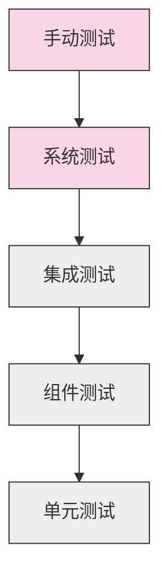

# 需求分析模块测试用例与质量指标

## 文档信息

| 属性 | 值 |
|------|------|
| 文档状态 | 初稿 |
| 版本号 | v0.1.0 |
| 撰写日期 | 2023-03-25 |
| 所属模块 | 需求分析系统 |

## 1. 测试策略概述

需求分析模块的测试采用多层次、多角度的测试策略，确保系统能够准确理解各类编程需求，并输出高质量的结构化规范。测试策略涵盖单元测试、集成测试、系统测试和性能测试，重点关注自然语言理解的准确性、鲁棒性和性能。

### 1.1 测试金字塔



### 1.2 测试类型与目标

| 测试类型 | 主要目标 | 执行频率 | 自动化程度 |
|---------|---------|----------|-----------|
| 单元测试 | 验证各算法和组件功能正确性 | 每次代码更改 | 高 (95%) |
| 集成测试 | 验证模块间接口和数据流 | 每次模块更改 | 中 (80%) |
| 系统测试 | 验证端到端功能和准确性 | 每周/每次重大更改 | 中 (60%) |
| 性能测试 | 验证响应时间和资源使用 | 每月/版本发布前 | 高 (90%) |
| 鲁棒性测试 | 验证错误处理和边界情况 | 每次重大算法更改 | 中 (75%) |

## 2. 单元测试用例

### 2.1 文本预处理器测试

**TC-1.1: 句子分割测试**

```python
def test_sentence_splitting():
    # 测试正常句子分割
    text = "创建一个函数。该函数处理CSV文件。"
    result = split_into_sentences(text)
    assert len(result) == 2
    
    # 测试带有技术术语的句子分割
    text = "实现一个基于REST API的服务。该服务需要支持OAuth 2.0认证。"
    result = split_into_sentences(text)
    assert len(result) == 2
    
    # 测试带有编号列表的分割
    text = "实现以下功能：1. 数据导入 2. 数据处理 3. 结果导出"
    result = split_into_sentences(text)
    assert len(result) == 4  # 包括主句和3个列表项
```

**TC-1.2: 技术术语识别测试**

```python
def test_technical_term_extraction():
    # 测试基本术语识别
    tokens = ["创建", "一个", "REST", "API", "服务"]
    pos_tags = ["v", "q", "x", "x", "n"]
    terms = extract_technical_terms(tokens, pos_tags)
    assert any(term['term'] == "REST API" for term in terms)
    
    # 测试技术术语变体识别
    tokens = ["使用", "TensorFlow", "或", "PyTorch", "实现"]
    pos_tags = ["v", "x", "c", "x", "v"]
    terms = extract_technical_terms(tokens, pos_tags)
    assert any(term['term'] == "TensorFlow" for term in terms)
    assert any(term['term'] == "PyTorch" for term in terms)
```

### 2.2 语义分析器测试

**TC-2.1: 意图分类测试**

```python
def test_intent_classification():
    # 测试函数创建意图
    text = PreprocessedText("创建一个处理CSV文件的函数")
    intent, confidence = classify_intent(text)
    assert intent == "CREATE_FUNCTION"
    assert confidence > 0.8
    
    # 测试API实现意图
    text = PreprocessedText("开发一个REST API端点，接收JSON数据")
    intent, confidence = classify_intent(text)
    assert intent == "IMPLEMENT_API"
    assert confidence > 0.8
    
    # 测试模糊意图
    text = PreprocessedText("数据处理操作")
    intent, confidence = classify_intent(text)
    assert confidence < INTENT_THRESHOLD  # 应低于阈值
```

**TC-2.2: 实体识别测试**

```python
def test_entity_extraction():
    # 测试基本实体提取
    text = PreprocessedText("创建一个函数，接收文件路径，返回处理后的数据")
    entities = extract_entities(text)
    
    # 验证是否提取了正确的实体
    entity_types = [e.entity_type for e in entities]
    assert "FUNCTION_TYPE" in entity_types
    assert "INPUT" in entity_types
    assert "OUTPUT" in entity_types
    
    # 验证实体内容
    input_entity = next((e for e in entities if e.entity_type == "INPUT"), None)
    assert input_entity and "文件路径" in input_entity.text
```

**TC-2.3: 关系提取测试**

```python
def test_relationship_extraction():
    # 准备测试数据
    text = PreprocessedText("创建一个函数，接收用户ID，返回用户资料")
    entities = extract_entities(text)
    
    # 测试关系提取
    relationships = extract_relationships(entities, text)
    
    # 验证输入关系
    has_input_relation = any(
        r.relation_type == "HAS_PARAM" and "用户ID" in r.target.text
        for r in relationships
    )
    assert has_input_relation
    
    # 验证输出关系
    has_output_relation = any(
        r.relation_type == "RETURNS" and "用户资料" in r.target.text
        for r in relationships
    )
    assert has_output_relation
```

### 2.3 DSL转换与验证测试

**TC-3.1: 类型推断测试**

```python
def test_type_inference():
    # 测试基于文本提示的类型推断
    entity = Entity("INPUT", "用户列表 (list of users)", 0, 14)
    semantic_result = create_mock_semantic_result()
    inferred_type = infer_parameter_type(entity, semantic_result)
    assert inferred_type == "List[User]" or inferred_type == "List"
    
    # 测试基于名称的类型推断
    entity = Entity("INPUT", "user_ids", 0, 8)
    entity.normalized_value = "user_ids"
    inferred_type = infer_parameter_type(entity, semantic_result)
    assert "List" in inferred_type or "Array" in inferred_type
    
    # 测试复杂类型推断
    entity = Entity("INPUT", "配置字典，包含服务器设置", 0, 12)
    inferred_type = infer_parameter_type(entity, semantic_result)
    assert inferred_type == "Dict" or inferred_type == "Dict[str, Any]"
```

**TC-3.2: DSL规范验证测试**

```python
def test_dsl_validation():
    # 测试有效规范验证
    valid_spec = TaskSpecification(task_type="function")
    valid_spec.inputs = [{"name": "data", "type": "List[Dict]"}]
    valid_spec.outputs = {"type": "DataFrame"}
    
    validation = validate_dsl_spec(valid_spec)
    assert validation.is_valid
    assert validation.validation_score > 0.9
    
    # 测试缺失必要字段的规范
    invalid_spec = TaskSpecification()  # 缺少task_type
    invalid_spec.inputs = [{"name": "data"}]  # 缺少type
    
    validation = validate_dsl_spec(invalid_spec)
    assert not validation.is_valid
    assert "Missing task type" in validation.errors
    assert any("missing type" in w.lower() for w in validation.warnings)
```

### 2.4 高级需求分析测试

**TC-4.1: 领域分类测试**

```python
def test_domain_classification():
    # 测试Web API领域识别
    text = "创建一个RESTful API，支持用户注册和登录"
    domains = classify_requirement_domain(text)
    assert any(domain == "WEB_API" for domain, _ in domains)
    
    # 测试数据处理领域识别
    text = "创建一个函数处理CSV数据，计算每列的统计信息"
    domains = classify_requirement_domain(text)
    assert any(domain == "DATA_PROCESSING" for domain, _ in domains)
    
    # 测试多领域识别
    text = "开发一个数据分析API，处理时间序列数据并返回JSON结果"
    domains = classify_requirement_domain(text)
    domains_only = [d for d, _ in domains]
    assert "WEB_API" in domains_only
    assert "DATA_PROCESSING" in domains_only or "DATA_ANALYSIS" in domains_only
```

**TC-4.2: 问题生成测试**

```python
def test_question_generation():
    # 测试基本问题生成
    requirement = "创建一个用户认证API"
    domain = "WEB_API"
    questions = generate_follow_up_questions(requirement, domain)
    
    # 验证问题数量和相关性
    assert len(questions) >= 3
    question_texts = [q['question'] for q in questions]
    
    # 检查是否包含关键问题
    auth_related = any("认证方式" in q or "身份验证" in q for q in question_texts)
    assert auth_related
    
    # 测试基于先前回答的问题生成
    previous_answers = {"认证方法": "使用JWT"}
    new_questions = generate_follow_up_questions(requirement, domain, previous_answers)
    
    # 验证问题是否基于先前回答进行调整
    jwt_related = any("JWT" in q or "token" in q.lower() for q in [q['question'] for q in new_questions])
    assert jwt_related
```

**TC-4.3: 技术决策测试**

```python
def test_decision_point_extraction():
    # 创建测试需求规范
    requirement_spec = {
        "task_type": "api",
        "inputs": [{"name": "user_data", "type": "Dict"}],
        "outputs": {"type": "Dict", "description": "用户认证结果"},
        "constraints": ["需要高安全性", "支持大量并发请求"]
    }
    
    # 测试决策点提取
    domain = "WEB_API"
    decision_points = extract_decision_points(requirement_spec, domain)
    
    # 验证是否提取了关键决策点
    decision_names = [d['name'] for d in decision_points]
    assert any("认证框架" in name for name in decision_names)
    assert any("API框架" in name for name in decision_names)
    
    # 验证决策点优先级排序
    assert decision_points[0]['importance'] >= decision_points[-1]['importance']
```

## 3. 集成测试用例

### 3.1 模块内集成测试

**TC-5.1: 预处理到语义分析集成测试**

```python
def test_preprocessing_to_semantic_integration():
    # 原始文本输入
    text = "创建一个函数，接收CSV文件路径，处理数据后返回JSON格式结果"
    
    # 执行集成流程
    result = preprocess_to_semantic(text)
    
    # 验证结果结构和内容
    assert isinstance(result, SemanticAnalysisResult)
    assert result.intent == "CREATE_FUNCTION"
    assert len(result.entities) >= 3  # 至少应有函数、输入和输出实体
    assert len(result.relationships) >= 2  # 至少应有输入和输出关系
```

**TC-5.2: 语义分析到DSL集成测试**

```python
def test_semantic_to_dsl_integration():
    # 准备语义分析结果
    semantic_result = create_test_semantic_result("CREATE_FUNCTION")
    
    # 执行集成流程
    domain_model = semantic_to_domain_model(semantic_result)
    dsl_spec = domain_model_to_dsl(domain_model)
    
    # 验证DSL规范
    assert dsl_spec.task_type == "function"
    assert len(dsl_spec.inputs) > 0
    assert dsl_spec.outputs is not None
    
    # 验证DSL验证
    validation = validate_dsl_spec(dsl_spec)
    assert validation.is_valid
```

### 3.2 模块间集成测试

**TC-6.1: 需求分析与代码生成接口测试**

```python
def test_requirement_to_code_interface():
    # 使用模拟代码生成器
    mock_code_generator = MockCodeGenerator()
    
    # 分析测试需求
    analyzer = RequirementAnalysisEngine()
    requirement = "创建一个计算两数之和的简单函数"
    analysis_result = analyzer.analyze(requirement)
    
    # 验证需求规范结构符合代码生成器期望
    assert analysis_result['status'] == 'success'
    assert 'requirement_spec' in analysis_result
    
    # 测试将需求规范传递给代码生成器
    generation_result = mock_code_generator.generate(analysis_result['requirement_spec'])
    
    # 验证代码生成器能够处理需求规范
    assert generation_result['success']
    assert 'code' in generation_result
    assert 'def add(' in generation_result['code']  # 验证生成的是加法函数
```

## 4. 系统测试用例

### 4.1 端到端功能测试

**TC-7.1: 简单需求端到端测试**

```python
def test_simple_requirement_end_to_end():
    # 测试系统
    system = AutoProgrammingSystem()
    
    # 简单需求
    requirement = "创建一个计算列表平均值的函数"
    
    # 执行端到端流程
    result = system.process_requirement(requirement)
    
    # 验证结果
    assert result['status'] == 'success'
    assert 'code' in result
    assert result['code'].strip() != ""
    
    # 验证生成的代码功能
    exec_result = system.execute_code(result['code'], test_input=[1, 2, 3, 4, 5])
    assert exec_result['output'] == 3.0  # 平均值应为3.0
```

**TC-7.2: 复杂需求端到端测试**

```python
def test_complex_requirement_end_to_end():
    # 测试系统
    system = AutoProgrammingSystem()
    
    # 复杂需求
    requirement = """
    创建一个REST API端点，接收用户提交的CSV文件，
    解析文件内容，计算每列的统计数据（平均值、中位数、标准差），
    并以JSON格式返回结果。API需要进行基本的错误处理。
    """
    
    # 执行端到端流程
    result = system.process_requirement(requirement)
    
    # 验证结果
    assert result['status'] == 'success'
    assert 'code' in result
    
    # 检查代码是否包含关键组件
    code = result['code']
    assert "FastAPI" in code or "Flask" in code  # 应使用Web框架
    assert "pandas" in code  # 应使用pandas处理CSV
    assert "mean" in code and "std" in code  # 应计算统计量
    assert "json" in code or "JSON" in code  # 应返回JSON
    assert "try" in code and "except" in code  # 应包含错误处理
```

### 4.2 鲁棒性测试

**TC-8.1: 模糊需求处理测试**

```python
def test_ambiguous_requirement_handling():
    # 测试系统
    system = AutoProgrammingSystem()
    
    # 模糊需求
    requirement = "创建数据处理功能"
    
    # 执行流程
    result = system.process_requirement(requirement)
    
    # 验证系统能够识别模糊需求并请求澄清
    assert result['status'] == 'needs_clarification'
    assert 'questions' in result
    assert len(result['questions']) > 0
    
    # 提供澄清信息
    clarifications = {
        "数据类型": "CSV文件数据",
        "处理操作": "计算每列的统计信息",
        "输出格式": "JSON"
    }
    
    # 重新执行流程
    updated_result = system.process_requirement(requirement, clarifications)
    
    # 验证系统能够利用澄清信息生成代码
    assert updated_result['status'] == 'success'
    assert 'code' in updated_result
```

**TC-8.2: 错误输入处理测试**

```python
def test_error_input_handling():
    # 测试系统
    system = AutoProgrammingSystem()
    
    # 测试空输入
    result = system.process_requirement("")
    assert result['status'] == 'error'
    assert 'message' in result
    
    # 测试无意义输入
    result = system.process_requirement("xyzabc123")
    assert result['status'] == 'error'
    assert 'message' in result
    
    # 测试非编程需求
    result = system.process_requirement("明天的天气如何？")
    assert result['status'] == 'error'
    assert 'non_programming_request' in result['error_type'].lower()
```

### 4.3 高级场景测试

**TC-9.1: 多轮需求细化测试**

```python
def test_multi_round_requirement_refinement():
    # 测试系统
    system = AutoProgrammingSystem()
    
    # 初始需求
    requirement = "创建一个用户管理API"
    
    # 第一轮：系统应请求澄清
    result1 = system.process_requirement(requirement)
    assert result1['status'] == 'needs_clarification'
    assert 'questions' in result1
    
    # 记录问题以便回答
    questions = result1['questions']
    
    # 准备回答
    answers = {}
    for q in questions:
        if "认证" in q['question']:
            answers[q['id']] = "使用JWT认证"
        elif "存储" in q['question']:
            answers[q['id']] = "使用PostgreSQL数据库"
        elif "用户信息" in q['question'] or "字段" in q['question']:
            answers[q['id']] = "用户名、邮箱、密码、角色"
        else:
            answers[q['id']] = "是"  # 默认肯定回答
    
    # 第二轮：提供澄清
    result2 = system.process_requirement(requirement, answers)
    
    # 可能需要进一步澄清
    if result2['status'] == 'needs_clarification':
        # 准备第二轮回答
        round2_answers = {}
        for q in result2['questions']:
            if "API端点" in q['question']:
                round2_answers[q['id']] = "需要实现：注册、登录、查询用户、更新用户、删除用户"
            elif "权限" in q['question']:
                round2_answers[q['id']] = "基于角色的权限控制"
            else:
                round2_answers[q['id']] = "默认配置即可"
        
        # 第三轮：提供进一步澄清
        result3 = system.process_requirement(requirement, {**answers, **round2_answers})
        assert result3['status'] == 'success'
        final_result = result3
    else:
        assert result2['status'] == 'success'
        final_result = result2
    
    # 验证最终代码包含所有需求细节
    code = final_result['code']
    assert "JWT" in code or "jwt" in code
    assert "PostgreSQL" in code or "postgresql" in code
    assert "用户名" in code and "邮箱" in code and "密码" in code and "角色" in code
    assert "注册" in code and "登录" in code
```

## 5. 性能测试用例

### 5.1 响应时间测试

**TC-10.1: 简单需求响应时间测试**

```python
def test_simple_requirement_response_time():
    # 测试系统
    system = AutoProgrammingSystem()
    
    # 简单需求
    requirement = "创建一个判断数字是否为素数的函数"
    
    # 测量响应时间
    start_time = time.time()
    system.process_requirement(requirement)
    end_time = time.time()
    
    # 计算响应时间
    response_time = (end_time - start_time) * 1000  # 毫秒
    
    # 验证响应时间在目标范围内
    assert response_time < 500  # 500毫秒以内
```

**TC-10.2: 复杂需求响应时间测试**

```python
def test_complex_requirement_response_time():
    # 测试系统
    system = AutoProgrammingSystem()
    
    # 复杂需求
    requirement = """
    创建一个Web服务，提供以下功能：
    1. 用户注册和登录（使用JWT认证）
    2. 文件上传和下载（支持大文件）
    3. 数据分析（基本统计和可视化）
    4. 报告生成（PDF格式）
    使用FastAPI框架，PostgreSQL数据库，并确保代码遵循最佳实践。
    """
    
    # 测量响应时间
    start_time = time.time()
    system.process_requirement(requirement)
    end_time = time.time()
    
    # 计算响应时间
    response_time = (end_time - start_time) * 1000  # 毫秒
    
    # 验证响应时间在目标范围内
    assert response_time < 3000  # 3秒以内
```

### 5.2 并发处理测试

**TC-11.1: 并发请求测试**

```python
def test_concurrent_requests():
    # 测试系统
    system = AutoProgrammingSystem()
    
    # 测试需求列表
    requirements = [
        "创建一个计算阶乘的函数",
        "实现一个简单的计算器函数",
        "编写一个字符串反转函数",
        "创建一个检查回文的函数",
        "实现一个查找数组最大值的函数"
    ]
    
    # 并发执行
    with concurrent.futures.ThreadPoolExecutor(max_workers=5) as executor:
        future_to_req = {executor.submit(system.process_requirement, req): req for req in requirements}
        results = {}
        
        for future in concurrent.futures.as_completed(future_to_req):
            req = future_to_req[future]
            try:
                results[req] = future.result()
            except Exception as e:
                results[req] = {"status": "error", "message": str(e)}
    
    # 验证所有请求都成功处理
    success_count = sum(1 for result in results.values() if result['status'] == 'success')
    assert success_count == len(requirements)
    
    # 验证没有请求超时
    timeout_count = sum(1 for result in results.values() if 'timeout' in result.get('error_type', '').lower())
    assert timeout_count == 0
```

### 5.3 内存使用测试

**TC-12.1: 内存峰值测试**

```python
def test_memory_peak_usage():
    # 测试系统
    system = AutoProgrammingSystem(memory_tracking=True)
    
    # 复杂需求
    requirement = """
    创建一个数据处理库，支持以下功能：
    1. CSV, JSON, XML等多种格式的数据导入导出
    2. 数据清洗和转换
    3. 基础统计分析
    4. 数据可视化
    设计良好的API接口，并提供详细文档。
    """
    
    # 执行处理并监控内存使用
    system.process_requirement(requirement)
    memory_stats = system.get_memory_stats()
    
    # 验证内存使用在合理范围内
    assert memory_stats['peak_usage_mb'] < 1024  # 峰值使用不超过1GB
    assert memory_stats['memory_leak'] == False  # 没有内存泄漏
```

## 6. 质量指标与基准

### 6.1 准确性指标

| 指标 | 定义 | 目标值 | 测量方法 |
|------|------|--------|----------|
| 意图识别准确率 | 正确识别需求主要意图的比例 | >90% | 人工标注的测试集验证 |
| 实体提取F1分数 | 实体提取的精确率和召回率的调和平均 | >85% | 人工标注的测试集验证 |
| 关系提取F1分数 | 关系提取的精确率和召回率的调和平均 | >80% | 人工标注的测试集验证 |
| 类型推断准确率 | 正确推断参数和返回值类型的比例 | >85% | 人工标注的测试集验证 |
| DSL转换完整率 | 需求关键点被正确转换到DSL的比例 | >95% | 人工审查测试样例 |

### 6.2 性能指标

| 指标 | 定义 | 目标值 | 测量方法 |
|------|------|--------|----------|
| 简单需求响应时间 | 处理100字以内需求的平均时间 | <500ms | 性能测试 |
| 复杂需求响应时间 | 处理500字以上需求的平均时间 | <3000ms | 性能测试 |
| 并发处理能力 | 同时处理10个请求的成功率 | >95% | 并发测试 |
| 内存峰值使用 | 处理复杂需求的内存峰值 | <1GB | 内存监控 |
| CPU使用率 | 处理请求时的CPU使用峰值 | <70% | 资源监控 |

### 6.3 鲁棒性指标

| 指标 | 定义 | 目标值 | 测量方法 |
|------|------|--------|----------|
| 模糊需求处理率 | 能够识别并合理处理模糊需求的比例 | >80% | 模糊需求测试集 |
| 错误需求处理率 | 能够优雅处理错误或无意义需求的比例 | 100% | 错误输入测试 |
| 极端输入处理率 | 处理异常长、复杂或特殊字符需求的成功率 | >90% | 极端输入测试 |
| 系统稳定性 | 连续处理100个请求无崩溃的成功率 | 100% | 稳定性测试 |

## 7. 测试覆盖率目标

### 7.1 代码覆盖率

| 覆盖类型 | 目标覆盖率 | 重点覆盖区域 |
|----------|-----------|-------------|
| 行覆盖率 | >90% | 核心算法和处理逻辑 |
| 分支覆盖率 | >85% | 条件判断和错误处理路径 |
| 函数覆盖率 | >95% | 所有公共API和接口 |

### 7.2 功能覆盖率

| 功能领域 | 目标测试用例数 | 覆盖要点 |
|----------|--------------|----------|
| 文本预处理 | 20+ | 各种文本格式和特殊情况 |
| 语义分析 | 30+ | 不同意图和实体类型 |
| DSL转换 | 25+ | 各种编程任务类型 |
| 高级需求分析 | 40+ | 各领域特定场景和决策点 |

## 8. 测试自动化

### 8.1 自动化测试框架

```python
class RequirementAnalysisTestFramework:
    def __init__(self):
        self.test_suites = {
            'unit': UnitTestSuite(),
            'integration': IntegrationTestSuite(),
            'system': SystemTestSuite(),
            'performance': PerformanceTestSuite()
        }
        self.results_collector = TestResultsCollector()
    
    def run_test_suite(self, suite_name, test_filter=None):
        """运行指定的测试套件"""
        if suite_name not in self.test_suites:
            raise ValueError(f"Unknown test suite: {suite_name}")
        
        suite = self.test_suites[suite_name]
        results = suite.run_tests(test_filter)
        self.results_collector.collect_results(suite_name, results)
        return results
    
    def run_all_tests(self):
        """运行所有测试套件"""
        results = {}
        for suite_name, suite in self.test_suites.items():
            suite_results = suite.run_tests()
            self.results_collector.collect_results(suite_name, suite_results)
            results[suite_name] = suite_results
        return results
    
    def generate_report(self, format='html'):
        """生成测试报告"""
        return self.results_collector.generate_report(format)
```

### 8.2 持续集成配置

```yaml
# .github/workflows/test.yml
name: Requirement Analysis Tests

on:
  push:
    branches: [ main, dev ]
  pull_request:
    branches: [ main ]

jobs:
  test:
    runs-on: ubuntu-latest
    
    steps:
    - uses: actions/checkout@v2
    
    - name: Set up Python
      uses: actions/setup-python@v2
      with:
        python-version: '3.9'
    
    - name: Install dependencies
      run: |
        python -m pip install --upgrade pip
        pip install pytest pytest-cov
        if [ -f requirements.txt ]; then pip install -r requirements.txt; fi
    
    - name: Run unit tests
      run: |
        pytest tests/unit --cov=requirement_analysis --cov-report=xml
    
    - name: Run integration tests
      run: |
        pytest tests/integration
    
    - name: Run performance tests (weekly)
      if: github.event_name == 'schedule'
      run: |
        pytest tests/performance
    
    - name: Upload coverage report
      uses: codecov/codecov-action@v1
```

## 9. 回归测试与质量把关

### 9.1 回归测试策略

每次代码更改都应运行以下回归测试流程：

1. **自动化单元测试**：确保所有组件功能正常
2. **集成测试子集**：验证关键接口和数据流
3. **冒烟测试**：基本功能验证（5-10个典型用例）

重大版本更新前应运行完整回归测试：

1. **全量单元和集成测试**
2. **系统功能测试**：端到端测试所有功能点
3. **性能基准测试**：确保性能指标不退化
4. **模糊测试**：验证系统鲁棒性

### 9.2 需求分析质量检查清单

每次发布前使用以下质量检查清单：

- ✅ 所有自动化测试通过率100%
- ✅ 代码覆盖率满足目标要求
- ✅ 性能指标满足基准要求
- ✅ 所有已知的严重和高优先级缺陷已修复
- ✅ 新增功能已有对应测试用例
- ✅ 文档已更新并与当前实现一致
- ✅ 静态代码分析无严重警告
- ✅ 安全扫描无高危漏洞
- ✅ 已进行人工探索性测试 